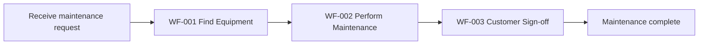
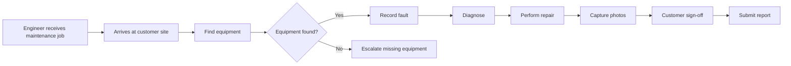
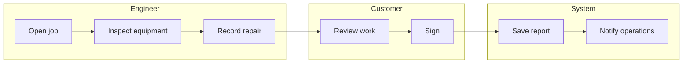
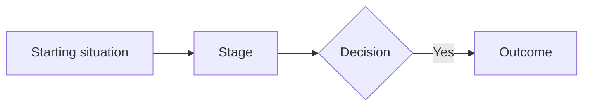

# P-STARTER

## What this file is

`P-Starter.md` is the bootstrap instruction for a project.

Drop it into a project folder, open a capable coding agent there, and it establishes and operates a
small, durable project operating system made of Markdown files.

It is a **recipe for the agent**, not project content and not a form for the owner. Once the project
files exist, they — not this file — are the project's knowledge.

## How to use it

**New or near-empty folder, or an existing project:** read Part 14 (Bootstrap), then Part 15
(Templates).

**Session to session, once established:** you do not need this file.

## Editing this file

**Reconcile; do not append.** This file states the same things in several places by design — the
structure list, the responsibilities table, the visual roles, the identifiers, the retrieval rules,
the templates, the folder rules and the bootstrap steps. **An addition made in one of them and not
the others produces a file that contradicts itself**, and the stale copy is usually the one an agent
follows, because bootstrap reads the structure list first.

When adding or changing anything structural, **check every place that enumerates the structure** and
update all of them in the same edit. Within this file, when something is stated in two places,
prefer making one point at the other rather than restating it.

**The Part 15 templates are the deliberate exception, and must restate.** They are copied into the
project and have to stand alone once this file is gone, so a rule they depend on belongs in them in
full. **Do not "de-duplicate" a template against the body** — that reads like tidying and produces a
project file with a hole in it. When body and template state the same rule, **both must be updated
together**; that duplication is the price of the templates being self-contained.

**Cross-references break silently.** This file refers to its own parts by number, and a part that is
added, split or renumbered leaves every reference to it quietly pointing somewhere plausible and
wrong. **After any structural edit, verify that each `(Part n)` still names the part that actually
holds the rule.** Nothing else will catch it — a wrong number reads exactly like a right one.

**The templates in Part 15 must never cite a part number.** They are copied into the project, and
the project is explicitly told not to read this file after bootstrap — so a `(Part n)` inside a
template becomes a reference the reader cannot follow and will not find. **State the rule in the
template, or name the project file that owns it.** The same applies to any prose the templates
generate.

## After initialisation, this file leaves the session

**Once the project has been successfully initialised, `P-Starter.md` is not part of the normal
session context.** It remains in the project as a **bootstrap and recovery reference only**.

Normal project operation is governed by `CLAUDE.md` and the canonical project files. Orient with
`PROJECT.md` → `STATUS.md` → `NEXT.md`.

**Do not read this file at the start of a session.** Read it only when one of these is directly
relevant to the task at hand:

- project structure — which canonical files exist and what each is for;
- bootstrap behaviour — setting up a new project, or absorbing an existing one;
- recovery — the project pack is damaged, incomplete or inconsistent and needs re-establishing;
- changes to the starter method itself.

It is not canonical project knowledge, and nothing should depend on it after bootstrap. Loading it
routinely wastes context that belongs to the actual work.

---

# Part 1 — The owner experience

**This part governs everything else. If a later rule creates owner work, this part wins.**

The project files exist to give the agent durable, portable memory. **They are not forms for the
owner to complete.** The owner should never have to operate the documentation system.

## The normal loop

```
DUMP
  → AGENT UNDERSTANDS AND ORGANISES
    → AGENT ASKS ONLY IMPORTANT QUESTIONS
      → AGENT BUILDS / UPDATES THE VISUAL PROTOTYPE
        → OWNER REVIEWS AND GIVES FEEDBACK
          → AGENT UPDATES PROJECT KNOWLEDGE + PROTOTYPE
            → REPEAT
              → BASELINE
                → PRODUCTION BUILD
```

The owner provides messy, incomplete material — requirements, ideas, meeting notes, transcripts,
client documents, screenshots, emails, existing specs, feedback, change requests, rough thoughts —
and communicates naturally:

> "Client changed this requirement." · "This screen is wrong." · "We decided to use Apple Watch."
> · "Forget this feature for v1." · "This workflow needs approval first." · "What's blocking us?"

The agent translates that into the right project-state changes.

## What the owner does — and does not do

**The owner:** provides information · answers material questions · reviews the prototype · gives
feedback · makes decisions when genuinely required · reviews the actual product.

**The owner never has to decide:** which file information belongs in · which ID to create ·
whether something is SPEC or FEATURES · whether something is an open item · whether a decision
needs recording · whether the changelog needs updating · which files need synchronising.

That is the agent's job, every time.

## The owner should not have to read Markdown either

The project files are durable memory for the agent. They are **not the owner's reading material**.

```
PROJECT FILES     = durable, portable project memory
CODING AGENT      = reads and maintains that memory
VISUAL INTERFACE  = presents that memory in human-readable visual form
GIT               = detailed technical history
```

**At initialisation, create a local visual project interface that derives its state from the
canonical Markdown files.** Use the project's existing web stack where one exists; otherwise the
lightweight default in Part 16. It becomes the owner's main way of understanding the project.

**The Markdown pack remains canonical.** The interface is derived from it and **must never become
the canonical store of project state**. Nothing is written back; if the interface and the files
disagree, the files are right.

This is why the templates carry stable IDs, consistent headings and simple tables — enough
structure for another system to interpret them reliably. It is not a licence to optimise the files
for machines: **they must still read naturally when opened directly** (Part 15).

## Do not make the owner the librarian

**BAD** — agent receives a requirement → asks which file to update → asks how to classify it →
asks for IDs → asks the owner to maintain related documents → asks the owner to reconcile
inconsistencies.

**GOOD** — agent receives a requirement → understands it → checks the relevant project context →
updates the appropriate project memory → preserves uncertainty where necessary → updates the
prototype or build where instructed → surfaces **only** the decisions and questions that genuinely
need owner judgement.

The owner owns the product. The agent maintains the project memory.

## Working from feedback

When the owner says *"users should be able to edit this before submitting"*, the agent works out
whether that changes a journey, the spec, a feature, a workflow, a story, an assumption, a
decision, the plan, the prototype, status, the next action, or project history — then updates only
what actually changed.

The owner should never have to say *"update WF-004, F-007, US-012 and SPEC §4.3."*

## Generate first, clarify second

Do as much useful structuring as the evidence safely supports **before** asking the owner anything.

```
OWNER DUMPS  →  AGENT EXTRACTS AND STRUCTURES  →  AGENT IDENTIFIES MATERIAL GAPS
             →  OWNER ANSWERS ONLY WHAT MATTERS
```

If 90% can be established safely from the supplied material, generate that 90% and surface the
remaining 10%. Do not stop all progress because something is unresolved.

**Never** turn startup into an interview that walks the owner through every template field. Ask
only questions whose answers materially affect the ability to understand, prototype or safely
proceed. An empty field is not a reason to ask a question.

---

# Part 2 — Canonical structure

```
PROJECT.md      USERS.md        USER-JOURNEYS.md   SPEC.md
FEATURES.md     WORKFLOWS.md    USER-STORIES.md    PROTOTYPE.md
RESEARCH.md     OPEN-ITEMS.md   DECISIONS.md       PLAN.md
STATUS.md       NEXT.md         CHANGELOG.md       CLAUDE.md

INPUTS/         RESEARCH/       prototype/
```

Sixteen Markdown files and three directories. That is the whole structure.

Note the two pairings: `PROTOTYPE.md` with `prototype/`, and `RESEARCH.md` with `RESEARCH/`. In
both, **the Markdown file is the register — what exists, what it found, what was accepted — and the
directory holds the material.** The register is read; the directory is opened only when the register
is insufficient.

Each file exists because it has a distinct responsibility (Part 4). Do not add canonical files or
directories, do not split these into smaller objects, and do not create registers, schemas or
ontologies for requirements, features, components, architecture, verification, releases, ADRs,
risks or stories.

If you believe another canonical file is genuinely necessary, **do not add it** — report it to the
owner with the concrete problem it solves. Part 11 covers a file that has genuinely outgrown itself.

---

# Part 3 — Durable memory

**The project folder is the durable project memory.**

```
Project folder  =  durable project knowledge
The agent       =  a temporary worker operating on that memory
Git             =  exact technical history of files and code
```

The project must stay understandable when the conversation disappears, context is compacted, a new
session starts cold, the project moves machines, a different agent takes over, or someone opens the
folder with nothing but a text editor.

Never let important project knowledge live only in conversation history, hidden tool state, or a
vendor's memory feature. **A session that produced real understanding but wrote nothing down has
lost that understanding.** Writing to the project files is the work, not paperwork after the work.

---

# Part 4 — What each file is for

| File | Answers |
|---|---|
| `PROJECT.md` | What is this project and why does it exist? |
| `USERS.md` | Who are we building for? |
| `USER-JOURNEYS.md` | What does each user need to accomplish end to end? |
| `SPEC.md` | What must the system do? |
| `FEATURES.md` | What capabilities does the product need? |
| `WORKFLOWS.md` | How does a user accomplish a specific task? |
| `USER-STORIES.md` | What do we need to build? |
| `PROTOTYPE.md` | What are we prototyping, what are we learning, and what is its lifecycle state? |
| `RESEARCH.md` | What did we investigate, what did it find, and what was accepted? |
| `INPUTS/` | What information did we receive? |
| `RESEARCH/` | The investigation itself. |
| `OPEN-ITEMS.md` | What do we not safely know? |
| `DECISIONS.md` | What did we decide and why? |
| `PLAN.md` | Where are we going and how are we approaching delivery? |
| `STATUS.md` | Where are we now? |
| `NEXT.md` | Where did we stop and what should happen next? |
| `CHANGELOG.md` | What materially changed over time? |
| `CLAUDE.md` | How should the agent work here? |
| Git | What exactly changed in the files and code? |
| `prototype/` | The working prototype implementation. |

Cross-reference between them; do not duplicate. **The same rule is written once, in the file that
owns it**, and referenced from everywhere else.

## Natural visual role

Each file has an obvious visual form. These are not required UI designs — the point is that each
file should hold information structured clearly enough that an interface can interpret it.

| File | Visual role |
|---|---|
| `PROJECT.md` | Project overview |
| `USERS.md` | Users / roles |
| `USER-JOURNEYS.md` | Journey map |
| `SPEC.md` | Structured specification |
| `FEATURES.md` | Capabilities / feature map |
| `WORKFLOWS.md` | Workflow views |
| `USER-STORIES.md` | Delivery / story board |
| `PROTOTYPE.md` + `prototype/` | Prototype and learning |
| `RESEARCH.md` + `RESEARCH/` | Research register and readable library |
| `OPEN-ITEMS.md` | Questions, assumptions, conflicts, dependencies, risks |
| `DECISIONS.md` | Decision history |
| `PLAN.md` | Roadmap / delivery plan |
| `STATUS.md` | Current project state |
| `NEXT.md` | Immediate next action |
| `CHANGELOG.md` | Material project timeline |
| Git | Detailed technical history |

### Identifiers and relationships

Stable IDs already exist for users (`U-`), journeys (`UJ-`), features (`F-`), workflows (`WF-`),
stories (`US-`), open items (`Q-`/`A-`/`C-`/`DEP-`/`R-`), decisions (`D-`) and research items
(`RS-`). **Preserve them** —
they are what makes cross-reference and visual navigation possible.

**Do not introduce identifiers for every paragraph or minor fact.** The goal is useful
relationships, not an ontology.

Records reference related records by ID where the relationship is real — a journey to its user,
workflows and features; a story to its user, journey, workflow, feature and spec rules; an open item
to what it affects; a decision to what it changes. **Do not force a relationship field to be
populated, and never invent a link to make the visual model look complete.**

### Visual truth

The interface must preserve the same distinctions the Markdown does — `CONFIRMED` / `OBSERVED` /
`ASSUMED` / `PROPOSED` / `UNRESOLVED` / `CONFLICTING` (Part 7), `SUPERSEDED` decisions, and status
values such as `PROPOSED` / `AGREED` / `IN PROGRESS` / `BUILT` / `VERIFIED` / `RELEASED`.

**Do not let consistent structure make everything look equally certain.** A rendered card for an
assumption must not look like a rendered card for a confirmed requirement.

### Do not over-engineer for visualisation

Do not add a graph schema, a relationship database, one file per entity, new canonical object
directories, or metadata frontmatter everywhere, because a future interface might benefit.

Use the existing files and simple relationships first. If a real visual feature later cannot be
built reliably from the current pack, **record the concrete limitation and propose the smallest
format change that fixes it** (Part 11). Complexity must be earned.

## The distinctions that blur

**`STATUS` vs `NEXT` vs `PLAN` vs `CHANGELOG`** — current state · immediate handoff · intended
direction · meaningful history. All four can be true at once:

> `STATUS`: "Prototype v2 is active. Seven of nine core workflows tested."
> `NEXT`: "Equipment search done; QR camera permissions unfinished. Next: US-014, test on device."
> `PLAN`: "Phase 2 closes once all nine workflows are tested; build follows."
> `CHANGELOG`: "2026-04-12 — Offline capture added to scope after v1 testing (see D-007)."

Keep `STATUS` and `NEXT` **short**. They are read at the start of every session and exist for agent
continuity, not as reports.

**`DECISIONS` vs `CHANGELOG`** — the choice and its reasoning · that something materially changed
and when. A changelog entry references the decision; it does not restate the reasoning.

**`USER-JOURNEYS` vs `WORKFLOWS`** — the end-to-end experience toward an outcome, normally
containing several workflows · one operational task performed to completion. Do not restate
workflow steps inside a journey.

**`SPEC` vs `FEATURES` vs `USER-STORIES`** — what must be true · a meaningful capability · a
buildable, testable slice. The rule is written once, in `SPEC.md`.

**`INPUTS/`** — evidence, preserved as received. Not automatically project truth.

---

# Part 5 — The reasoning flow

```
PROJECT → USERS → USER JOURNEYS → SPEC → FEATURES → WORKFLOWS → USER STORIES → PROTOTYPE
```

**PROJECT** — what are we building and why? The problem, purpose, outcome, scope, constraints.
**USERS** — who are we building for? Real roles and responsibilities, never invented personas.
**USER JOURNEYS** — what must each user accomplish, start to finish? May cross several workflows,
features, people, systems, hand-offs and waiting periods.
**SPEC** — what must the system do? Requirements, rules, permissions, data, integrations,
validations, states, exceptions, constraints, acceptance criteria.
**FEATURES** — what meaningful capabilities does the product need?
**WORKFLOWS** — how does a user accomplish a specific task? Triggers, steps, decisions,
alternatives, hand-offs, exceptions, completion.
**USER STORIES** — coherent, buildable, testable slices.
**PROTOTYPE** — is this actually what we mean to build?

**Research is not a stage in this flow.** It runs alongside it, resolving things the flow cannot
answer from the owner or `INPUTS/`, and its findings enter the flow only by deliberate acceptance
into the file that owns them.

## It is a reasoning model, not a sequence of documents

**Do not operate like:** finish PROJECT → finish USERS → finish every JOURNEY → finish SPEC →
finish FEATURES → finish WORKFLOWS → finish STORIES → finally prototype.

That is not the process. **The files are generated together from the same source material and
evolve together.** Completeness is not the goal and is usually not achievable.

A journey often exposes a missing user; a workflow a missing rule; a story an ambiguous
requirement. Go back and update the earlier file — that is the flow working.

The objective at every point: **enough shared understanding to make the product concrete quickly
and safely.**

---

# Part 6 — Prototype and lifecycle

## The lifecycle

```
DEFINE ⇄ PROTOTYPE
    → BASELINE
        → BUILD
            → VERIFY
                → LIVE
                    → MAINTENANCE
                        → COMPLETE / ARCHIVED
```

Descriptive, not mandatory gates. Projects skip phases and revisit them.

Do not treat these as synonyms: **defined** is not baselined · **prototyped** is not defined ·
**baselined** is not built · **built** is not verified · **verified** is not released · **live** is
not finished · **maintenance** does not mean no further product change.

Where each lives: `PROJECT.md` the phase · `STATUS.md` what is happening within it · `PLAN.md`
intended movement · `PROTOTYPE.md` the prototype's own state · `CHANGELOG.md` material phase
changes · `NEXT.md` the immediate action.

## DEFINE ⇄ PROTOTYPE — the only pair that loops

For a software project the visual prototype builds the application out **before** the production
application is built.

```
DEFINE ENOUGH → BUILD / UPDATE VISUAL PROTOTYPE → USE / REVIEW / TEST → LEARN
   → UPDATE PROJECT KNOWLEDGE → UPDATE PROTOTYPE → REPEAT → BASELINE → PRODUCTION BUILD
```

Its purpose is to reach the point where the intended product is understood well enough to build it
properly.

## Two kinds of prototype work

Both governed by `PROTOTYPE.md`, both in `prototype/`. Do not create separate structure.

**VISUAL PRODUCT PROTOTYPE** — the primary kind for an interactive software product. The first
working expression of the current understanding: something to see, navigate, use, review and
challenge. It progressively builds out the important parts of the application. It is **not** a
collection of isolated experiments.

The central question: **"Is this actually what we mean to build?"**

It exists so the owner can react to something concrete instead of specifying abstractly, and say
things like *yes this is right · no this is wrong · move this · this workflow makes no sense · this
information is missing · we don't need this · this should happen earlier · this user needs another
action.* **That feedback is project evidence.**

**The prototype participates in product definition.** It is not a validation step bolted on at the
end. Written definitions are agreeable and vague in a way running software is not.

**TARGETED EXPERIMENT / SPIKE** — secondary. Focused construction to resolve one specific
uncertainty: a data feasibility test, model evaluation, technical or integration spike, workflow
simulation, interaction experiment, manual process test.

A project may use only the visual prototype, both, or experiments before parts of the visual
prototype.

## Build the thing that lets you look

Before iterating on anything whose output you cannot see, build the smallest
thing that renders what the code believes — the page it thinks it is reading,
the state it thinks it is in, the shape it thinks it produced. Then look at it
after every change.

This is not a nice-to-have, and not a debugging tool bolted on once there is
trouble. It is the cheapest instrument in the project and it is the thing that
ends guessing. Work driven by counts instead can be rebuilt three times and fail
three times, while the fault is obvious the moment somebody looks at a picture
of it.

It belongs in `prototype/`, or beside the code it inspects, and it is worth a
line in `PROTOTYPE.md` saying what it draws and how to run it.

## When to prototype

**Visual prototype:** when making the emerging product concrete will materially improve
understanding, review or validation before production build. **Begin once enough is known to
represent something useful without arbitrary invention** — do not wait for documentation
perfection.

For a normal interactive software product this is a **normal part of definition, not an exceptional
activity**. It does not have to earn its way past a justification test. It is not universal either:
a library, a data migration or a batch pipeline may gain little.

**Targeted experiment:** when constructing and testing something is the cheapest reliable way to
resolve a specific material uncertainty.

Do not prototype merely because the project is new, and do not build an experiment merely because
an uncertainty exists.

## Technical unknowns do not block visual prototyping

**Do not require production technical decisions to be settled first**, unless they genuinely affect
what the prototype must teach.

An unresolved hosting decision does not prevent representing a workflow. An unresolved production
stack does not prevent building a disposable prototype. A service that does not yet exist can be
mocked, if the purpose is to test the product experience rather than the integration.

The prototype may use mock data, fake APIs, hard-coded states, simulated integrations, simplified
authentication, temporary navigation and components, simplified persistence and disposable code.

### But do not silently invent product behaviour

Mocking *technical infrastructure* is legitimate. Inventing *unresolved product behaviour* is not.

When the prototype must represent something undecided: judge whether a temporary assumption is safe
→ record it in `OPEN-ITEMS.md` as an `ASSUMPTION` and under Temporary Assumptions in
`PROTOTYPE.md` → the prototype may then embody it while it remains unconfirmed.

Its presence in running software is never confirmation. A working demo is more persuasive than a
paragraph, which makes this the easier mistake and the more damaging one.

### Label uncertainty; do not lecture

Being honest about what is mocked or undecided is **not** licence to fill the prototype with
disclaimers.

**Never add:**

- a global banner — *"PROTOTYPE — mock data, nothing saved, not the production application"*;
- a note on every screen restating that this is a prototype;
- explanations of things the owner already knows, in a prototype they asked for.

The owner knows it is a prototype. **They asked for it.** Telling them repeatedly wastes the screen
space that should be showing the product, and reads as though they need reminding.

**Do add**, once and quietly, exactly where it is actionable:

- a note naming a **specific undecided behaviour**, with its open-item ID, on the screen where that
  decision would show — *"Day boundary assumed as local midnight — the real rule is undecided
  (Q-026)"*;
- a marker on a **specific value** whose nature could mislead — an estimate, a device-derived
  figure, a value with no confirmed source.

The test: **does this note tell the owner something they could act on?** If it only tells them what
they already know, delete it. Prefer a chip on the value over a paragraph on the page, and
understate rather than shout — these notes are footnotes, not warnings.

## When an uncertainty appears, ask what would resolve it

Finding an uncertainty does not tell you what work resolves it. Ask *what evidence would settle
this*: asking the owner · verifying against `INPUTS/` · inspecting an existing system or dataset ·
research · measurement or testing · a technical spike · a prototype · another evidence-producing
method.

Avoid three failures: do not automatically build an experiment because an uncertainty exists (most
are settled by one question); do not automatically decide construction cannot help (ruling it out
is itself a judgement); do not assume "prototype" means only a UI, or only an isolated experiment.

An agent's proposed resolution method is `PROPOSED` (Part 7) and must be labelled as
agent-generated. Recording *"the resolution method has not been determined"* is a complete and
correct answer — better than a plausible plan the owner never agreed to.

## BASELINE

**A lifecycle transition, not a new file.** Do not create `BASELINE.md`.

> *"We understand the intended product sufficiently to begin production implementation."*

It does **not** mean every future requirement is known, every uncertainty is resolved, the
specification can never change, or the project becomes a waterfall. Changes still occur during
BUILD and are handled through `OPEN-ITEMS.md`, `DECISIONS.md`, the definition files and
`CHANGELOG.md`.

Record it in `PROJECT.md` (phase) and `CHANGELOG.md`. Set `PROTOTYPE.md`'s lifecycle state to
`HISTORICAL`.

### The handover

The project transitions from developing the prototype to developing the production application.

**Do not assume prototype code becomes production code.** Production is built from the accepted
project definition and appropriate production engineering standards. Prototype code may be reused
only where deliberately assessed and found suitable — *"it already works in the prototype"* is not
sufficient justification.

## After BUILD — three things stay separate

```
INTENDED      canonical project files — what we currently intend to build
PROTOTYPED    prototype/ — what we explored to understand and refine that intention
IMPLEMENTED   production code — what actually exists
```

**Never collapse these.** Prototype behaviour does not become an approved requirement merely
because it exists. Production behaviour does not become intended behaviour merely because it was
implemented. Written requirements do not become verified behaviour merely because they are
documented.

`prototype/` is now a **historical design and learning artefact**, expected to become outdated.
**That is normal and correct.**

Do not: keep it synchronised with production · implement every production change in it · update it
merely because production changed · treat its behaviour as current intended behaviour · treat
divergence as a defect · use it as an implementation source of truth · spend effort maintaining it
once its purpose is fulfilled.

`PROTOTYPE.md` records the state — `NOT STARTED`, `ACTIVE`, `HISTORICAL`. Those three suffice; add
no files or structure to manage them.

## Prototyping again later

BUILD does not permanently end prototyping. When a later feature, redesign, workflow, integration
or material uncertainty would benefit from being made concrete first, **prototype again
deliberately** — the new uncertain area, for a specific purpose. Learn, update canonical knowledge,
implement the accepted result in production.

That does not mean reviving the original prototype as a second application that tracks production.

---

# Part 7 — Evidence, inference and provenance

**This rule is mandatory.**

Well-formed documentation is not necessarily true. Do not assume something is correct because it is
neatly structured, was written by a previous session, or was generated by a capable model.

| State | Meaning |
|---|---|
| **CONFIRMED** | Explicitly stated, agreed or approved. |
| **OBSERVED** | Established from existing behaviour, code or data — but not confirmed as *intended*. |
| **ASSUMED** | Currently believed or relied upon, without confirmation. |
| **PROPOSED** | Suggested, not agreed. |
| **UNRESOLVED** | Not yet known. |
| **CONFLICTING** | Credible sources or states disagree. |

Never silently convert:

```
prototype behaviour  →  confirmed requirement        assumption   →  fact
existing code        →  intended behaviour           proposal     →  approval
implementation       →  verification                 well-written →  evidence
```

## Do not manufacture

Do not invent users, journeys, features, requirements, workflows, stories, business rules,
permissions, dependencies, dates, decisions, progress, verification results, prototype scope, or
recommended courses of action — and not because a template has an empty heading.

**An empty section, or one that says "not known", is better than an invented one.** The first is
honest and cheap to fill later; the second is indistinguishable from real knowledge and will be
relied upon.

Preserve the uncertainty in `OPEN-ITEMS.md`, and cite sources for consequential content — e.g.
`INPUTS/2026-03-04-client-brief.pdf § 4.2`.

## Provenance laundering — prohibited

**Writing an agent-generated idea into a canonical file does not make it project truth.**

```
agent has an idea → writes it into a canonical file → a later session reads it
   → indistinguishable from owner-confirmed fact → work is planned and built on it
```

No single step looks wrong. That is what makes it dangerous: provenance is lost at step 2 and can
never be recovered from the file itself.

When you write something you reasoned out rather than received: **label it `PROPOSED`**, **name it
as agent-generated**, **keep it out of the files that mean agreement** (`SPEC.md`, prototype scope
in `PROTOTYPE.md`, `PLAN.md`, the recommended action in `NEXT.md`, `DECISIONS.md`), and **surface
it as owner input** if approval is needed before acting.

The prototype does not launder provenance either: **implementing behaviour in the prototype does
not make it confirmed.** Prototype behaviour becomes a requirement only by deliberate acceptance
into `SPEC.md` and the definition files.

The test: *would the owner recognise this as something they said or agreed?* If not, it is yours,
and must be labelled as yours.

## Characterise a resource by using it

**Reading *about* a tool, dataset, supplier or service is not examining it.** If the question is
what it contains, permits or costs, **open it and find out.**

**Read the terms governing the resource, not the terms of whatever links to it.** They are often
different documents, and the specific one usually overrides the general one.

**Declining to look in order to avoid prejudging prevents the question being answered at all.**
Caution has a cost, the owner pays it, and it is not automatically the safe choice.

---

# Part 8 — Context management

Use **progressive disclosure**. Do not read every project file at the start of every session.

```
Default orientation:   PROJECT.md  →  STATUS.md  →  NEXT.md
```

Then ask: *what do I actually need for this task?* Search first, read relevant sections second,
expand only when necessary. `CHANGELOG.md` is **not** part of the default bootstrap.

Implementing one story typically needs:

```
the story → its workflow → its feature → the relevant SPEC rules → the relevant code
```

Add the **journey** when the story depends on a broader experience or hand-off. Add
`OPEN-ITEMS.md` when behaviour looks unclear or an assumption may be load-bearing. Add
`DECISIONS.md` when the reasoning behind a current constraint matters. Add `CHANGELOG.md` when you
need to know how the project reached its current state. Add `INPUTS/` when the files are
insufficient, provenance matters, or there is a conflict to check against source. Add `RESEARCH.md`
when an open item may already have been investigated, or before choosing between options it covers —
and read inside `RESEARCH/` only when the register entry is insufficient.

Do not automatically read every story, workflow, feature, decision or input, or the whole spec.

**Do not optimise token usage at the expense of correctness.** If context is genuinely needed to
act safely, retrieve it.

---

# Part 9 — Verification discipline

Do not equate:

```
written             with  confirmed          built             with  verified
prototyped          with  defined            verified          with  released
implemented         with  correct            deployed          with  accepted
prototype-tested    with  production-ready
```

When you state something is verified, there must be evidence, and you should be able to say what it
was. Match the formality of verification to the risk.

Do not introduce a verification ontology to satisfy this rule. `STATUS.md`, `USER-STORIES.md`,
`PROTOTYPE.md` and ordinary test evidence suffice for most projects. If a project genuinely needs
formal verification records, propose the smallest addition and get agreement (Part 11).

## A count is not evidence

A number that moves is not proof that it moved for the right reason.
"Detection found 95 fields" says nothing about whether they are the right 95,
and a change that raises it can be a change that made the work worse.

Where output has a shape a person can recognise — a page, a screen, a document,
a diagram — look at the output itself before believing any measure of it. Where
it does not, say what the number is evidence of and what it is not.

---

# Part 10 — Conflicts

When information appears to conflict, **do not silently pick whichever is convenient**, and do not
quietly edit files until they agree.

Investigate what kind of conflict it is: `SPEC.md` may state *intended* behaviour; the code
*observed implemented* behaviour; `PROTOTYPE.md` *experimental* behaviour; `INPUTS/` an *earlier*
request; `DECISIONS.md` that it was *superseded*; `CHANGELOG.md` *when* it changed.

Very often the conflict is two states of the same thing over time, and durable evidence resolves it.
If it cannot be resolved safely, record a `CONFLICT` in `OPEN-ITEMS.md` and surface it.

Do not rewrite history to make files look consistent.

---

# Part 11 — Simplicity, and not over-documenting

**Complexity must be earned by an actual project need**, not anticipated.

## Do not over-document

Structured memory is useful only when it contains useful information. Do not create:

- requirements for obvious implementation details;
- user stories merely to achieve coverage;
- workflows for trivial interactions;
- decisions for inconsequential choices;
- open items for harmless unknowns;
- changelog entries for routine edits;
- elaborate plans where a simple sequence suffices;
- documentation whose only purpose is satisfying another documentation rule.

`OPEN-ITEMS.md` in particular must not become a dumping ground. Record only what is worth preserving
across sessions or could materially affect definition, prototype, build, verification or release.

**Do not optimise for documentation completeness.** Optimise for understanding, truth, continuity,
useful prototype feedback, safe implementation, and recoverability by another capable agent.

## When to grow

If a canonical file genuinely becomes too large to navigate, too expensive to retrieve from, or
unable to represent the project safely, a split may be warranted.

**Do not migrate automatically.** Explain: what problem has emerged, why the current structure is
insufficient, the smallest change that solves it, and how portability is preserved. Get agreement
before introducing new canonical structure.

---

# Part 12 — Git

Where available, use Git as the detailed technical history.

```
Git → what exactly changed?          STATUS.md → what is true now?
CHANGELOG.md → what materially changed?      NEXT.md → what happens next?
DECISIONS.md → why did we choose this?
```

Do not reproduce Git's history by hand in `CHANGELOG.md`. Do not let a commit message be the only
place an important decision is recorded — a decision that exists only there is effectively lost.
An entry may reference a commit where useful; do not require a hash on every entry.

## Intentionally empty canonical directories

Git does not track empty directories, so a legitimately empty one — usually `prototype/` before any
prototype exists — is absent from a clone, breaking Part 3's portability rule.

Use an empty `prototype/.gitkeep`, and `RESEARCH/.gitkeep` while no research exists. It is a **Git
portability placeholder only**: not canonical project knowledge, kept empty, and **not to be read as
project context**. Add one only for a canonical directory that is currently empty. `INPUTS/`
normally has material from day one and needs
none.

---

# Part 13 — Portability

The folder must remain understandable without any particular tool or model provider.

Do not make canonical project knowledge depend on conversation history, an application's database,
hidden state, a specific SaaS product, a specific model, or proprietary memory not represented in
the folder.

`CLAUDE.md` may contain Claude-specific operating instructions. **The project knowledge itself must
stay provider-neutral** — a capable non-Claude agent, or a human, should be able to read
`PROJECT.md` → `STATUS.md` → `NEXT.md` and continue without ever opening `CLAUDE.md`.

If another provider needs its own bootstrap, it should point at the same project files rather than
creating a parallel copy.

---

# Part 14 — Bootstrap: "set up this project"

The owner should be able to drop material into `INPUTS/` (or paste it), say *"set up this
project"*, and get a working project pack back — without being interviewed.

1. **Read** what exists — supplied material, `INPUTS/`, existing files, existing code.
2. **Understand** the project as far as the evidence allows.
3. **Generate and populate** the canonical files from Part 2 that do not already exist, using the
   Part 15 templates. Generate them **together** from the same source material — not one at a time
   in flow order (Part 5).
4. **Separate** confirmed, observed, assumed, proposed, unresolved and conflicting information
   (Part 7). Populate only what the evidence supports; preserve uncertainty rather than filling
   gaps.
5. **Record** material unknowns in `OPEN-ITEMS.md` and material owner-stated decisions in
   `DECISIONS.md`.
6. **Ask the owner only** questions whose answers materially affect the ability to understand,
   prototype or safely proceed. Not one question per empty field.
7. **Assess prototype readiness** — is enough known to represent a useful first slice? If so,
   identify the smallest one from the supported users, journeys, workflows, features and stories.
8. **Create the local visual project interface** (Part 1) so the owner can see the project without
   reading Markdown. Derive it from the canonical files; never write project state back into it.

Files may legitimately start with no entries, open questions, marked assumptions or minimal
content. `CHANGELOG.md` may have none at all, and `RESEARCH.md` usually starts with an empty
register. **Create them anyway.** A canonical file that exists and says "nothing yet" tells a later
session where that kind of knowledge belongs; a missing one invites it to invent a new place.

The goal is **"the best supported current representation of the project"** — not "fill every
section".

After bootstrap: `STATUS.md` states the current state plainly, `NEXT.md` identifies the single most
useful next action, `OPEN-ITEMS.md` makes the important unknowns visible, and `PROTOTYPE.md` says
what it would represent — or says plainly that nothing exists yet.

**Do not conclude that a prototype should not be built merely because production decisions remain
unresolved** (Part 6).

## Existing project

**Do not assume the folder is blank.** Inspect it first. Do not overwrite existing source code,
documentation, configuration or project knowledge because this starter prefers a different
structure — fold it in or reference it; if genuinely superseded, preserve the original in `INPUTS/`.

Existing implementation is **OBSERVED** evidence of what exists, not proof of intended behaviour.
Where implementation and stated intent differ, record a `CONFLICT` rather than declaring either
correct.

Do not fabricate a clean history, and do not reconstruct `CHANGELOG.md` entries from inference
unless the owner asks.

---

# Part 15 — File templates

Each template below is the initial content for that file. Copy it in, then populate what the
evidence supports.

**These are the agent's working files, not the owner's forms.** The self-describing sections exist
so a fresh agent can maintain the file correctly — not so the owner has to read them. Never ask the
owner to fill one in.

Every template is **self-describing**. Every generated file MUST carry all six of these, as
headings, in this order:

1. **Purpose of this file** — what it is for
2. **It answers** — the one question it answers, stated explicitly
3. **What belongs here**
4. **What does not belong here**
5. **When to update**
6. **Relationship to other files**

A template may add sections of its own between them — Rules, or a file-specific procedure — but it
may not drop one of the six. They are how a fresh agent or a new person maintains the file
correctly without this bootstrap file, and a file missing them will drift.

`CLAUDE.md` is the single exception: it carries 1, 2 and a "must not become" statement, then its own
operating sections, because it is an agent guide rather than a project-knowledge file.

**Check this before finishing a bootstrap.** It is the finding most often missed, because the body
of a file can look complete while a header section is absent.

Adjust the remaining headings to suit the project. Do not add content merely to fill a heading.

---

=== BEGIN TEMPLATE: PROJECT.md ===

# PROJECT

## Purpose of this file

This file is the primary orientation document for the project.

**It answers:** *What is this project and why does it exist?*

Read it before interpreting any other project file.

## What belongs here

Project-level understanding: name, owner, background, the problem, purpose, intended outcomes,
high-level scope, explicit out-of-scope items, business context, stakeholders, known constraints,
current lifecycle phase, and important operational information.

Operational fields are supported where relevant — start and end dates, contract and maintenance
dates, team, roles, allocation, planned and actual effort, milestones. **Omit any field that does
not apply to this project.** An internal tool has no contract dates; do not invent them.

## What does not belong here

- Detailed system behaviour → `SPEC.md`
- Detailed user information → `USERS.md`
- End-to-end experiences → `USER-JOURNEYS.md`
- Delivery sequencing → `PLAN.md`
- Current state → `STATUS.md`
- Unknown information → `OPEN-ITEMS.md`

Do not let this become the detailed product specification.

## When to update

When the fundamental purpose, ownership, scope, context, constraints, lifecycle phase or intended
outcome changes. Not after routine work.

## Relationship to other files

Everything downstream should be traceable back to something here. `USERS.md` identifies who this
is for; `USER-JOURNEYS.md` what they need to achieve; `SPEC.md` what the system must do to support
that. `STATUS.md` says where the project currently is within the phase recorded here.

---

## Project

### Name

### Client / Owner

### Background

### Problem

### Purpose

### Intended Outcomes

### High-Level Scope

### Out of Scope

### Business Context

### Key Stakeholders

| Person | Role | Involvement |
|---|---|---|

### Known Constraints

### Current Lifecycle Phase

[DEFINE ⇄ PROTOTYPE / BASELINE / BUILD / VERIFY / LIVE / MAINTENANCE / COMPLETE / ARCHIVED]

*DEFINE and PROTOTYPE iterate together. BASELINE is the transition to production implementation —
the point at which we understand the intended product well enough to begin production
implementation. It is a phase marker, not a file, and not a specification freeze.*

---

## Operational Information

*Include only what applies. Delete the rest.*

### Dates

| | Date |
|---|---|
| Project start | |
| Target end | |
| Actual end | |
| Contract start | |
| Contract end | |
| Maintenance start | |
| Maintenance end | |

### Team

| Person | Role | Allocation |
|---|---|---|

### Effort

**Planned:**
**Actual:**

### Milestones

| Milestone | Target | Status |
|---|---|---|

=== END TEMPLATE: PROJECT.md ===

---

=== BEGIN TEMPLATE: USERS.md ===

# USERS

## Purpose of this file

This file defines the people, roles and user groups that materially affect the product.

**It answers:** *Who are we building for?*

## What belongs here

One section per materially different user type or role, describing actual responsibilities and
behaviour: context, goals, responsibilities, needs, pain points, relevant permissions or
limitations, and the journeys, workflows and features that matter to them.

## What does not belong here

- Detailed permission rules → `SPEC.md`
- End-to-end experiences → `USER-JOURNEYS.md`
- Task-level steps → `WORKFLOWS.md`
- Unknown user information → `OPEN-ITEMS.md`

**Do not invent personas.** Do not invent demographics, motivations, pain points or behaviours
that project information does not support. Describe real roles, not characters.

## How to decide whether two users are separate

Keep them separate when they differ materially in **permissions, workflows, responsibilities or
information access**. Otherwise do not create the category.

If the product genuinely has one user, say so. If one person operates in materially different
modes — capturing on the move versus administering the system — those modes may be worth
separating, but only where the difference actually changes what gets built.

## When to update

When a user type is added, removed or materially changes; when responsibilities, permissions or
needs change; when prototype or user testing corrects an understanding recorded here.

## Relationship to other files

Users are referenced by `USER-JOURNEYS.md` (whose journey), `WORKFLOWS.md` (primary actor) and
`USER-STORIES.md` (the "as a…"). Permissions stated loosely here are specified precisely in
`SPEC.md`.

---

## Users

### U-001 — [Role / user type]

**Context:**

**Goals:**

**Responsibilities:**

**Needs:**

**Pain Points:**

**Permissions / Limitations:**

**Related Journeys:**

**Related Workflows:**

**Related Features:**

**Open Items:**

---

## Non-Human Actors

*Optional. External systems, services or automated agents that act on the system and are
referenced by journeys and workflows. Not users, but named here for consistency.*

| Actor | Role |
|---|---|

=== END TEMPLATE: USERS.md ===

---

=== BEGIN TEMPLATE: USER-JOURNEYS.md ===

# USER JOURNEYS

## Purpose of this file

This file describes the important end-to-end experiences users go through.

**It answers:** *What does each user need to accomplish, from their starting situation to their
intended outcome?*

## What belongs here

Journeys that span the whole experience. A journey may cross several workflows, features, screens,
people, external systems, decisions, hand-offs and waiting periods.

Give each a stable identifier: `UJ-001`, `UJ-002`, `UJ-003`. Never renumber.

Write from the user's perspective. Include technical detail only where it materially affects their
experience.

## What does not belong here

- The detailed steps of a workflow → `WORKFLOWS.md` (reference it by ID instead)
- Capabilities → `FEATURES.md`
- Rules → `SPEC.md`
- Unknown stages → `OPEN-ITEMS.md`

Do not invent stages to make a journey look complete.

## Journey vs workflow

A journey is broader. It normally contains several workflows and shows how they connect.

Example: `UJ-001 — Field engineer completes a maintenance visit` may contain WF-001 Find
Equipment, WF-002 Record Fault, WF-003 Record Repair, WF-004 Capture Sign-Off, WF-005 Submit
Report. The journey shows how those connect, where the experience breaks between them, and what
the user is trying to achieve overall. It does not repeat their steps.

## What journeys are for

Use them to work out which workflows matter, which capabilities are necessary, what should be
prototyped, where hand-offs break, and whether the complete user outcome is actually supported —
rather than a set of individually reasonable features that do not add up to a usable experience.

## Check the set is complete

A missing journey is the hardest gap to notice, because nobody misses what was never written. Two
checks catch most of them:

**Walk the project's own operating model.** If the project states a cycle — *measure → baseline →
intervene → observe → learn → adjust* — walk each step and confirm it has a journey. The
unglamorous steps are the ones that go missing: establishing a baseline before changing anything is
a journey, not a preamble to one.

**Follow the things that leave the system and come back.** A test performed elsewhere, a document
that arrives later, a third party who does part of the work. The stages outside the system are
usually where the experience actually breaks, and recording that a stage *is* outside the system is
useful — it stops a later session building features for it that were never asked for.

## When to update

When a journey is added or materially changes; when a hand-off, stage or outcome changes; when
prototype or user testing shows the real experience differs from what is recorded.

## Relationship to other files

`USERS.md` supplies the primary user. Journeys reference `WORKFLOWS.md` and `FEATURES.md` by ID.
They inform what `SPEC.md` must cover and what `PROTOTYPE.md` should test.

---

## Journey diagrams

A journey may carry a **Mermaid diagram** giving a visual of the same journey described in prose.

**The written journey is canonical. The diagram is a derived aid** for understanding it quickly.
It is not a second source of truth.

Mermaid is the default because it lives inside the Markdown — no image files, no design tool, no
export step, and it stays readable and diffable alongside the words it illustrates. Do not
generate PNGs or design files instead.

### When to include one

When the journey has enough stages, branches, hand-offs, actors or system interactions that seeing
it helps. A linear four-stage journey is usually clearer in prose alone.

**Do not add diagrams mechanically for trivial journeys.** A diagram that only restates a list is
maintenance cost with no benefit, and it will go stale first.

### Keeping it honest

- Derive it from the journey described here — not from the code, the prototype, or an idea of how
  it might work.
- **If the written journey changes, update the diagram in the same change.**
- **If the diagram and the prose disagree, the prose is authoritative** and the diagram is wrong.
  Fix the diagram; do not quietly edit the prose to match a picture.
- A diagram must not introduce stages, actors, rules or branches that appear nowhere else in the
  project knowledge. Drawing a box does not make it a requirement.

### What to show

Where relevant: starting point; user or actor; major stages; decisions; alternative paths;
hand-offs; external actors; external systems; the relevant workflows; end state or outcome.

**Do not overload it** with every button click or implementation detail. The diagram communicates
the end-to-end journey; it does not duplicate the workflow definitions.

Keep the distinction:

```
USER-JOURNEYS.md   = the end-to-end user experience
Journey diagram    = a visual of that end-to-end experience
WORKFLOWS.md       = the detailed operational processes within it
```

Reference workflows at the stage where they occur rather than reproducing their steps:



### Format

Use Mermaid inside this file. Prefer `flowchart` for most journeys.



Where multiple actors or systems matter, use subgraphs or clear labels:



### Relationship to the prototype

The prototype may read a journey diagram to work out which stages should be demonstrable, which
workflows need prototype coverage, which hand-offs need testing, and where prototype gaps exist.

**Do not make the diagram depend on prototype routes.** The journey is product knowledge; the
prototype is one implementation used to test it. Prototype routes belong on the launchpad cards
described in `PROTOTYPE.md`, not in this diagram.

---

## Journey Index

| ID | Journey | Primary User | Status |
|---|---|---|---|

---

## UJ-001 — [Journey name]

**Primary User:**

**Goal:**

**Starting Situation:**

**Trigger:**

**Desired Outcome:**

### Journey Diagram *(optional — omit if the journey is simple enough not to need one)*



### Journey Stages

#### 1. [Stage name]

**What the user is trying to do:**

**What happens:**

**Related Workflows:**

**Related Features:**

**Pain Points / Risks:**

#### 2. [Stage name]

**What the user is trying to do:**

**What happens:**

**Related Workflows:**

**Related Features:**

**Pain Points / Risks:**

### Decisions / Hand-offs

-

### Risks / Failure Points

-

### Related Workflows

### Related Features

### Related User Stories

### Open Items

=== END TEMPLATE: USER-JOURNEYS.md ===

---

=== BEGIN TEMPLATE: SPEC.md ===

# SPECIFICATION

## Purpose of this file

This file is the primary specification of required system behaviour.

**It answers:** *What must the system do?*

## What belongs here

Expected behaviour, described as precisely as the available information allows: scope, out of
scope, functional requirements, business rules, permissions and access, data requirements,
integrations, validations, states and transitions, exceptions, edge cases, error behaviour,
non-functional requirements, security requirements, technical constraints, acceptance criteria.

This file states **what must be true**.

## What does not belong here

- Capability summaries → `FEATURES.md`
- User processes → `WORKFLOWS.md`
- Buildable slices → `USER-STORIES.md`
- Unknown, assumed or conflicting behaviour → `OPEN-ITEMS.md`

Do not invent behaviour to make the specification look complete. Preserve uncertainty explicitly,
in place, with a pointer to the relevant open item.

## Two rules that matter most here

**Prototype behaviour does not automatically become specification.**
**Implemented behaviour does not automatically become intended behaviour.**

Findings from a prototype or from existing code are incorporated here only when deliberately
accepted. Until then they are `OBSERVED`, not `CONFIRMED`.

## When to update

When behaviour is agreed, clarified, changed or rejected; when a decision changes what the system
must do; when prototype learning is accepted; when an open item resolves into a rule.

## Relationship to other files

`USER-JOURNEYS.md` and `WORKFLOWS.md` describe how the behaviour is experienced and performed;
this file states what must be true regardless. `FEATURES.md` groups it into capabilities;
`USER-STORIES.md` slices it into buildable work. Both reference rules here rather than restating
them.

---

## Scope

## Out of Scope

## Functional Requirements

## Business Rules

## Permissions and Access

## Data

## Integrations

## Validations

## States and Transitions

## Exceptions and Edge Cases

## Error Behaviour

## Non-Functional Requirements

## Security Requirements

## Technical Constraints

## Acceptance Criteria

=== END TEMPLATE: SPEC.md ===

---

=== BEGIN TEMPLATE: FEATURES.md ===

# FEATURES

## Purpose of this file

This file describes the capabilities the product provides.

**It answers:** *What can the product do?*

## What belongs here

A feature is a **meaningful product capability** — distinct enough to be useful when
understanding, designing, prototyping, planning or building the system.

Give each a stable identifier: `F-001`, `F-002`, `F-003`. Never renumber; mark retired features
retired rather than deleting the ID.

Every feature should have a reason traceable to the project, users, journeys or specification.

## What does not belong here

- Detailed rules → `SPEC.md`
- Detailed processes → `WORKFLOWS.md`
- Buildable slices → `USER-STORIES.md`
- Unknowns → `OPEN-ITEMS.md`

**Do not create a feature per requirement.** This file is not a restatement of `SPEC.md` with
different numbering. If a "feature" is really a rule, it belongs in the spec.

**Do not mark a feature confirmed merely because it appears in a prototype.**

## When to update

When a capability is added, removed or substantially changed; when status changes; when
dependencies between capabilities change.

## Relationship to other files

Features are referenced by `USER-JOURNEYS.md` (what the journey relies on), `WORKFLOWS.md` (what
the task uses) and `USER-STORIES.md` (what the slice builds toward). Their rules live in
`SPEC.md`.

## Prototype demo fields

*Only relevant while a prototype exists.*

The prototype may include a `/features` demo launchpad — a page of cards that open real prototype
screens, so a capability can be shown without hunting for URLs. It is generated from **this file**,
which stays canonical; the launchpad is a disposable demo aid, not documentation.

To support it, a feature may carry the optional fields below.

**These fields are optional.** Omit them when there is no prototype, or no screen for this
feature. **Never invent a prototype route to fill an entry.** If a feature is specified but not
represented in the prototype, say so honestly — an empty field is fine, a link that goes nowhere
is not.

---

## Feature Index

| ID | Feature | Status |
|---|---|---|

---

## F-001 — [Feature name]

**Purpose:**

**Users:**

**Description:**

**Key Behaviour:**

**Related Journeys:**

**Related Workflows:**

**Related User Stories:**

**Dependencies:**

**Status:** [PROPOSED / AGREED / IN PROGRESS / BUILT / VERIFIED / BLOCKED / RETIRED]

**Open Items:**

### Prototype / Demo *(optional)*

**Prototype Status:** [NOT BUILT / PARTIAL / BUILT]

**Prototype Route:**

**Demo Group:** [e.g. Onboarding / Daily Use / Review / Administration / Reporting]

**Demo Description:** [One demo-friendly line for the launchpad card.]

**Demo Persona:**

**New Since Last Demo:** [yes / no]

**Prototype Caveat:** [What the prototype simulates or fakes, if anything.]

=== END TEMPLATE: FEATURES.md ===

---

=== BEGIN TEMPLATE: WORKFLOWS.md ===

# WORKFLOWS

## Purpose of this file

This file describes how users accomplish specific tasks using the product.

**It answers:** *How is the product actually used?*

## What belongs here

Important user processes, written from the user's operational perspective rather than the
application's technical architecture.

Give each a stable identifier: `WF-001`, `WF-002`, `WF-003`. Never renumber.

A workflow should describe a **meaningful task or outcome**, not an individual button click.

## What does not belong here

- The broader end-to-end experience → `USER-JOURNEYS.md`
- Capabilities → `FEATURES.md`
- Rules → `SPEC.md` (reference them; do not restate)
- Buildable slices → `USER-STORIES.md`
- Steps you cannot establish → `OPEN-ITEMS.md`

**Do not invent missing steps.** A workflow with a plausible-looking invented middle is worse than
one that stops and records what is unknown.

## When to update

When a process changes; when an exception path is discovered; when prototype or user testing shows
the real process differs from what is recorded.

## Relationship to other files

A workflow normally belongs to one or more journeys in `USER-JOURNEYS.md` and uses features from
`FEATURES.md` under rules from `SPEC.md`. `USER-STORIES.md` slices it into buildable work.

## Prototype demo fields

*Only relevant while a prototype exists.*

The prototype may include a `/workflows` demo launchpad — a page organised by process, letting
someone walk an end-to-end cycle by opening real prototype screens step by step. It is generated
from **this file**, which stays canonical; the launchpad is a disposable demo aid, not
documentation.

The workflow's stable ID (`WF-007`) carries through to the launchpad and is displayed there,
because it is what gets referred to out loud in a demo. **Do not let the prototype invent a second
numbering scheme.**

To support the launchpad, a workflow may carry the optional fields below, and individual steps may
carry a deep link where that step can be demonstrated directly.

**These fields are optional.** Omit them when there is no prototype or no corresponding screen.
**Never fabricate a route or a state that does not exist**, and note honestly where the prototype
only simulates part of the process.

---

## Workflow Index

| ID | Workflow | Primary Actor | Journey | Status |
|---|---|---|---|---|

---

## WF-001 — [Workflow name]

**Primary Actor:**

**Other Actors:**

**Trigger:**

**Preconditions:**

### Normal Flow

1.
2.
3.

*While a prototype exists, a step may carry a prototype route where it can be demonstrated
directly — e.g.*
`2. Filter to employees requiring attention. → /moderation?level=Division&unit=Division%20A&filter=attention`
*Steps with no demonstrable screen are still listed; they just carry no link.*

### Decisions

-

### Alternative Flows

### Hand-offs

-

### Exceptions / Failure Flows

**Completion Condition:**

**Related Journey:**

**Related Features:**

**Relevant Business Rules:**

**Open Items:**

### Prototype / Demo *(optional)*

**Prototype Status:** [NOT BUILT / PARTIAL / BUILT]

**Prototype Route:** [Opening route for the workflow.]

**Demo Summary:** [One or two demo-friendly lines for the launchpad card.]

**Demo Persona:**

**Demo Group:** [The operating cycle or journey this belongs to — not the app's menu structure.]

**Prototype Caveat:** [What the prototype simulates or fakes, if anything.]

=== END TEMPLATE: WORKFLOWS.md ===

---

=== BEGIN TEMPLATE: USER-STORIES.md ===

# USER STORIES

## Purpose of this file

This file translates supported product behaviour into coherent, buildable, testable slices.

**It answers:** *What do we need to build?*

## What belongs here

Stories for behaviour the project actually supports. Give each a stable identifier: `US-001`,
`US-002`, `US-003`. Never renumber.

Use the standard form where it helps:

> As a [user], I want [capability], so that [outcome].

Do not force that wording where it makes the story less clear.

Acceptance criteria must describe **observable behaviour** — what can be seen to be true, not what
was implemented.

**Every rule needs at least one example.** An acceptance criterion states a rule; an example shows
that rule happening with real values. A rule is where two people agree and still mean different
things, and whoever builds this — including an agent reading the file at midnight — cannot ask
which was meant. One or two examples per rule is enough; use the values you would actually type.

**Say what the story is not.** One line. It is the cheapest way to prevent work nobody asked for,
and it is where scope quietly grows when it is missing.

**Say what would prove it, before the work starts.** The status discipline below refuses VERIFIED
without evidence. Write down here what that evidence will be, while the story is still cheap to
argue about.

## What does not belong here

- Rules → `SPEC.md`
- Capabilities → `FEATURES.md`
- Processes → `WORKFLOWS.md`
- Delivery sequencing → `PLAN.md`
- Unknown behaviour → `OPEN-ITEMS.md`

**Do not create stories to fill a backlog.** Do not create a story for behaviour that has not been
established — write the open item instead.

## Status discipline

**"Code written" is not "verified".** Move a story to VERIFIED only when there is evidence for the
acceptance criteria, and be able to say what that evidence was.

## When to update

When a story is added, refined, split, completed, verified or dropped; when acceptance criteria
change; when a dependency or blocker changes.

## Relationship to other files

Each story should point to its feature, workflow and journey, and to the spec rules that govern
it. `PLAN.md` sequences the work; this file defines it.

**`SPEC.md` owns the rules; this file owns the examples.** A story cites a rule by its identifier
rather than restating it, so a rule has one home and cannot drift between two. The worked examples
belong to the story, because they are what make that one slice buildable and checkable.

---

## Story Index

| ID | Story | Feature | Status |
|---|---|---|---|

---

## US-001 — [Story name]

**Story:**

As a [user],
I want [capability],
so that [outcome].

**Acceptance Criteria:**

-
-
-

**Examples:**

_One or two per rule, with real values. What goes in, what comes out._

-

**Not this story:**

-

**Done when:**

_What evidence will show the acceptance criteria hold._

**Related Feature:**

**Related Workflow:**

**Related Journey:**

**Relevant Specification / Rules:**

**Dependencies:**

**Status:** [PROPOSED / AGREED / IN PROGRESS / BUILT / VERIFIED / BLOCKED]

=== END TEMPLATE: USER-STORIES.md ===

---

=== BEGIN TEMPLATE: PROTOTYPE.md ===

# PROTOTYPE

## Purpose of this file

This file governs the project's prototype: what is being represented, why, what we are trying to
understand, what we have learned, and where the prototype sits in its own lifecycle.

**It answers:** *What are we prototyping, what are we learning, and what is the lifecycle state of
the prototype?*

`prototype/` holds the working prototype itself. This file holds what it represents, what it is
meant to teach, and what it taught us.

## Two kinds of prototype work

**Visual product prototype** — the primary kind for an interactive software product. The first
working expression of our current understanding: something to see, navigate, use, review and
challenge before production build. It answers *"is this actually what we mean to build?"*

**Targeted experiment / spike** — secondary. Focused construction to resolve one specific
uncertainty: a data feasibility test, model evaluation, technical or integration spike, workflow
simulation, interaction experiment or manual process test.

Both are governed here and both live in `prototype/`.

## What belongs here

What the current prototype represents and deliberately excludes; the mocks, simulations, temporary
assumptions and shortcuts it uses; what we want to learn from it; review and feedback; what was
learned; and what the next iteration should change.

## What does not belong here

- The prototype code → `prototype/`
- Accepted product behaviour → `SPEC.md` (deliberately, after a finding is accepted)
- Resulting decisions → `DECISIONS.md`
- New or changed uncertainty → `OPEN-ITEMS.md`
- Delivery sequencing → `PLAN.md`

## When to update

Before an iteration is built (what it represents, what it should teach); after review or testing
produces evidence (what was learned, what changes). Keep earlier iterations' findings — do not
overwrite what was learned.

## Relationship to other files

Prototype scope is drawn from `USERS.md`, `USER-JOURNEYS.md`, `WORKFLOWS.md`, `FEATURES.md` and
`USER-STORIES.md` — it represents supported understanding rather than inventing new product
direction. Accepted learning flows back into those files and `SPEC.md`; new uncertainty into
`OPEN-ITEMS.md`; material decisions into `DECISIONS.md`; delivery changes into `PLAN.md`; material
project-level change into `CHANGELOG.md`.

## Rules

**The prototype participates in product definition.** It does not wait for the definition to be
finished. Begin once enough is known to represent something useful without arbitrary invention.

**Unresolved production technology does not block it.** Mock data, fake APIs, hard-coded states,
simulated integrations, simplified authentication, temporary navigation and disposable code are all
legitimate. Optimise for what the prototype must teach, not for production architecture,
scalability, abstraction, completeness or polish — unless one of those is what is being tested.

**But do not silently invent unresolved product behaviour.** Where the prototype must represent
something undecided, judge whether a temporary assumption is safe, record it in `OPEN-ITEMS.md` as
an `ASSUMPTION` and list it under Temporary Assumptions below. It may then be embodied in the
prototype while it remains unconfirmed.

**Prototype behaviour is not an approved requirement. Prototype code is not production code.
Prototype architecture is not production architecture.** Learning must be deliberately accepted
into the project files; it never migrates there by itself. Never let
`prototype behaviour → assumed requirement → production implementation` happen without that
acceptance.

**Label every shortcut, mock and assumption below**, so a later session can tell a deliberate
simplification from a decision.

**Do not write scope the owner has not agreed to.** An experiment or slice the agent thought of is
`PROPOSED`: label it as agent-generated, keep it out of `PLAN.md` and
`NEXT.md`, and surface it as owner input. Anything recorded here reads as agreed scope to every
later session.

**Do not populate the sections below with invented content to make the file look complete.** If no
prototype exists, say so.

## Lifecycle state

The prototype has three states. They are sufficient — do not add files or structure to manage them.

| State | Meaning |
|---|---|
| `NOT STARTED` | No prototype has been built. |
| `ACTIVE` | The prototype is the current working representation, in the DEFINE ⇄ PROTOTYPE loop. |
| `HISTORICAL` | The project has passed BASELINE; production build has taken over. The prototype is a design and learning artefact. |

**At BASELINE** — when the intended product is understood well enough to begin production
implementation and BUILD takes over:

- change the lifecycle state to `HISTORICAL`;
- record plainly that the prototype is no longer the current implementation;
- preserve the learning and history already recorded here;
- **do not continue maintaining it by default** — it is expected to become outdated, and that is
  correct. Do not sync it with production, and do not treat divergence as a defect.

While `HISTORICAL`, the sections below are a record of what was explored, not a description of
current intended behaviour. Canonical intended behaviour is in the definition files; what exists is
in production code.

**Prototyping again later** does not mean reviving this prototype to track production. Prototype the
new uncertain area for a specific purpose, learn, update canonical knowledge, then implement in
production. A later prototype may be recorded here as a new iteration returning the state to
`ACTIVE` for that work.

---

## Current Prototype

**Lifecycle State:** [NOT STARTED / ACTIVE / HISTORICAL]

**Iteration:**
**Status:** [PLANNED / IN PROGRESS / IN REVIEW / SUPERSEDED]

**Objective:**

**What part of the application is represented:**

### Represented

**Users:**

**Journeys:**

**Workflows:**

**Features:**

**Stories:**

**Important states:**

### Deliberately excluded

-

### Mocks and simulations

*What is faked, and what it stands in for.*

| Mocked | Stands in for | Why |
|---|---|---|

### Temporary assumptions

*Unresolved product behaviour the prototype embodies in order to be usable. Each must have an
`ASSUMPTION` in `OPEN-ITEMS.md`. Presence here is not confirmation.*

| Assumption | Open item | Why it was safe to proceed |
|---|---|---|

### Deliberate shortcuts

*Simplifications that must not be mistaken for production decisions.*

-

### Known gaps

-

---

## What We Want to Learn

**What needs validation:**

**Workflows that need review:**

**Interactions that need review:**

**Assumptions being exercised:**

**Evidence / feedback required:**

**What would constitute a useful result:**

---

## Review / Testing

| Date | Who | What was exercised |
|---|---|---|

**Observations:**

**Feedback:**

**Failures / confusion:**

**Missing behaviour:**

**Unexpected behaviour:**

---

## Learning

**What we learned:**

**Assumptions supported:**

**Assumptions rejected:**

**New questions:**

**Required project-definition changes:**

*What must change in `PROJECT.md`, `USERS.md`, `USER-JOURNEYS.md`, `SPEC.md`, `FEATURES.md`,
`WORKFLOWS.md`, `USER-STORIES.md`, `OPEN-ITEMS.md`, `DECISIONS.md` or `PLAN.md`. Learning is not
accepted until those files are updated.*

**Required prototype changes:**

---

## Next Prototype Iteration

**What should change:**

**Why:**

**What it should let us learn:**

**Or: are we at BASELINE?** If the intended product is understood well enough to begin production
implementation, the next step is not another iteration — it is the BASELINE transition: record the
phase change in `PROJECT.md` and `CHANGELOG.md`, and set the lifecycle state above to `HISTORICAL`.

---

## Targeted Experiments / Spikes

*Secondary to the visual prototype. Use one when constructing and testing something is the cheapest
reliable way to resolve a specific material uncertainty. Omit this section entirely if there are
none — do not list speculative ideas here as though they were planned work.*

### [Experiment name]

**Uncertainty addressed:** [the `OPEN-ITEMS.md` item]

**Origin:** [owner direction / `INPUTS/` / existing decision / **agent proposal — PROPOSED**]

**Why construction rather than another method:**

**What it is:**

**What would constitute a useful result:**

**Status:** [PROPOSED / AGREED / RUNNING / COMPLETE]

**Findings:**

=== END TEMPLATE: PROTOTYPE.md ===

---

=== BEGIN TEMPLATE: RESEARCH.md ===

# RESEARCH

## Purpose of this file

This file is the register of investigation done for this project — by the agent, and by the owner
supplying external material.

**It answers:** *What have we investigated, what did it find, how confident are we, and what has
been accepted?*

`RESEARCH/` holds the research items themselves. This file is the register.

## What belongs here

One entry per research item, with a stable identifier (`RS-001`, `RS-002`…): the question it set out
to answer, where the material came from, what it found, how confident that finding is, what it
explicitly does **not** establish, and whether it has been accepted into the project definition.

Research is investigation that produces **evidence** — a comparison of options, an evaluation of a
data source or model, a review of published guidance, a standards or market scan, a summary of
external material the owner supplied.

## What does not belong here

- Source material as received → `INPUTS/`
- What we do not know → `OPEN-ITEMS.md`
- Constructed experiments and spikes → `PROTOTYPE.md` and `prototype/`
- Choices made → `DECISIONS.md`
- Accepted system behaviour → `SPEC.md`

**Against `INPUTS/`:** inputs are what the project was *given*, preserved as received. Research is
what was *investigated* to answer a question. A document the owner drops in is an input; a
comparison of it against three alternatives is research.

**Against `PROTOTYPE.md`:** research reads, compares and evaluates. A prototype or spike *builds*
something to find out. If the answer requires construction, it is a targeted experiment.

## Rules

**Every finding cites its source.** A claim without a source is an opinion and does not belong here.

**Record where the material came from** — `OWNER-SUPPLIED`, `AGENT-GATHERED` or `MIXED`. This
matters more here than anywhere else, because agent-gathered research is the easiest place for a
confident fabrication to enter the project already looking like evidence. Agent-gathered material
that cannot be pointed at is not a source.

**Research does not become project truth by being written down.** A finding is `OBSERVED` at best.
It reaches `SPEC.md`, `FEATURES.md` or a decision only by deliberate acceptance, and the entry
records when that happened.

**Record what the research does not establish.** Usually the most useful field, and the one that
stops a partial finding being over-applied later.

**Confidence is stated, not implied:** `HIGH` · `MODERATE` · `LOW`.

**Every finding records how long it stays true.** A specification rule holds until someone changes
it; a finding about the world holds until the world moves. Statutory rates, thresholds, prices,
competitor positions and published guidance all expire, and an expired finding is more dangerous
than a missing one, because it still reads as evidence.

So each item carries **`As of`** — the date the material was true, which is not always the date it
was written — and **`Recheck`**, either a date or the event that should trigger it: *before
quoting*, *at each Budget*, *annually*. Where a finding genuinely does not expire, say `Recheck:
none — does not expire` rather than leaving it blank, so the reader can tell a considered answer
from an omission.

**Not every question needs research.** Most are answered by asking the owner or checking `INPUTS/`.

## When to update

When an item is started, produces findings, is accepted or rejected, or is superseded by later
evidence.

## Relationship to other files

Research usually exists to resolve something in `OPEN-ITEMS.md`, and an accepted finding closes or
narrows that item. A resulting choice is recorded in `DECISIONS.md` and referenced here. Behaviour
it changes is changed deliberately in `SPEC.md`. `INPUTS/` holds raw material; `RESEARCH/` holds the
investigation.

---

## Register

| ID | Title | Question | Origin | Status | Confidence | As of | Recheck | Resolves |
|---|---|---|---|---|---|---|---|---|

**Status:** `PLANNED` · `IN PROGRESS` · `FINDINGS` · `ACCEPTED` · `REJECTED` · `STALE` ·
`SUPERSEDED`

`SUPERSEDED` means something replaced it. `STALE` means its `Recheck` has passed and nobody has
looked — the finding may still be right, but nothing should be leant on it until someone confirms.

---

## Research needed

*Optional. Open items whose answer looks like it needs investigation rather than an owner decision.
Mark clearly as an agent assessment where it is one — the resolution method for an open item is not
settled by appearing in this list.*

| Open item | Why research rather than a decision |
|---|---|

---

## Items

## RS-001 — [Title]

**Question:** [What this set out to answer.]

**Origin:** [OWNER-SUPPLIED / AGENT-GATHERED / MIXED]

**Status:** [PLANNED / IN PROGRESS / FINDINGS / ACCEPTED / REJECTED / STALE / SUPERSEDED]

**Confidence:** [HIGH / MODERATE / LOW]

**As of:** [YYYY-MM-DD — the date the material was true]

**Recheck:** [YYYY-MM-DD, or the trigger, or "none — does not expire"]

**Resolves / informs:** [Q-nnn, F-nnn, D-nnn — or "nothing yet"]

**Material:** `RESEARCH/YYYY-MM-DD-slug.md`

### Sources

| Source | Type | Where it came from |
|---|---|---|

### Method

[How the material was gathered and compared. Enough that someone could repeat it.]

### Findings

-

### What this does NOT establish

-

### Limitations

-

### Accepted

[What was accepted, into which file, on what date — or "not accepted".]

=== END TEMPLATE: RESEARCH.md ===

---

=== BEGIN TEMPLATE: OPEN-ITEMS.md ===

# OPEN ITEMS

## Purpose of this file

This file records what is not yet safely known.

**It answers:** *What do we not safely know?*

It exists to stop uncertain, conflicting, missing or externally dependent information from being
silently converted into fact.

## What belongs here

| Type | Meaning | ID |
|---|---|---|
| **QUESTION** | Something needs an answer. | `Q-001` |
| **ASSUMPTION** | We are proceeding on something not confirmed. | `A-001` |
| **CONFLICT** | Two or more sources, behaviours or decisions disagree. | `C-001` |
| **DEPENDENCY** | Something external must happen or be supplied. | `DEP-001` |
| **RISK** | Something uncertain may materially affect the project. | `R-001` |

Identifiers are stable. Never renumber and never reuse.

## What does not belong here

- Decisions already made → `DECISIONS.md`
- Work to be done → `USER-STORIES.md` or `PLAN.md`
- Current state → `STATUS.md`

An open item is about **knowledge**, not about tasks. "Build the export screen" is work. "We do
not know which formats export must support" is an open item.

## Rules

**Do not silently turn an assumption into a fact.** When an assumption is confirmed, record the
resolution here *and* update the file that now states it as fact.

**Do not leave resolved items looking open.** A stale open item is worse than none — it makes the
whole file untrustworthy.

## When to update

Whenever uncertainty is created, changed or resolved. Creating open items is normal and healthy;
a project with none has usually stopped noticing.

## Relationship to other files

Every other file points here when it cannot state something safely. On resolution, the knowledge
moves into the appropriate file (`SPEC.md`, `USERS.md`, `PROJECT.md`, …) and, if the choice was
material, a decision is recorded in `DECISIONS.md`.

---

## Index

| ID | Type | Title | Status | Owner |
|---|---|---|---|---|

---

## Q-001 — [Title]

**Type:** QUESTION

**Description:**

**Why It Matters:**

**Owner:**

**Source:**

**Impact:**

**Related:**

**Target Resolution:**

**Status:** OPEN

**Resolution:**

---

## A-001 — [Title]

**Type:** ASSUMPTION

**Description:** [What we are proceeding on without confirmation.]

**Why It Matters:**

**What Happens If Wrong:**

**Owner:**

**Source:**

**Related:**

**Status:** OPEN

**Resolution:**

---

## C-001 — [Title]

**Type:** CONFLICT

**Description:** [What disagrees with what.]

**Sources In Conflict:**

-
-

**Why It Matters:**

**Owner:**

**Impact:**

**Related:**

**Status:** OPEN

**Resolution:**

---

## DEP-001 — [Title]

**Type:** DEPENDENCY

**Description:** [What must be supplied, decided or done externally.]

**Depends On:**

**Why It Matters:**

**Owner:**

**Blocks:**

**Needed By:**

**Status:** OPEN

**Resolution:**

---

## R-001 — [Title]

**Type:** RISK

**Description:**

**Why It Matters:**

**Likelihood / Impact:**

**Owner:**

**Mitigation:**

**Related:**

**Status:** OPEN

**Resolution:**

=== END TEMPLATE: OPEN-ITEMS.md ===

---

=== BEGIN TEMPLATE: DECISIONS.md ===

# DECISIONS

## Purpose of this file

This file records important project decisions and the reasoning behind them.

**It answers:** *What did we decide, and why?*

It gives future sessions, agents and people durable memory of both the choice and why it was made
— so a later session does not silently undo a deliberate decision it does not understand.

## What belongs here

Decisions that materially affect product behaviour, scope, users, journeys, workflows, delivery,
architecture, technology, integrations, project constraints, prototype direction, or that involve
a significant trade-off.

Give each a stable identifier: `D-001`, `D-002`, `D-003`.

## What does not belong here

- Minor implementation choices
- Every change that resulted from a decision → `CHANGELOG.md`
- Open questions → `OPEN-ITEMS.md`
- Delivery sequencing → `PLAN.md`

## Rules

**Do not rewrite old decisions to make history look cleaner.** If a later decision replaces an
earlier one, keep the earlier one and mark it `SUPERSEDED`, with a pointer each way. The reasoning
that was later abandoned is often the most useful thing in this file.

## When to update

When a material decision is made, reversed or superseded. Not every session produces one.

## Relationship to other files

A decision usually resolves an item in `OPEN-ITEMS.md`, changes something in `SPEC.md`,
`FEATURES.md`, `PLAN.md` or elsewhere, and — if the effect is material — earns an entry in
`CHANGELOG.md` that references it rather than restating the reasoning.

---

## Decision Index

| ID | Date | Decision | Status |
|---|---|---|---|

---

## D-001 — [Decision title]

**Date:**

**Status:** [ACTIVE / SUPERSEDED / REVERSED]

**Decision:**

**Context / Problem:**

**Reason:**

**Alternatives Considered:**

**Source / Evidence:**

**Impact:**

**Related Items:**

**Supersedes:**

**Superseded By:**

=== END TEMPLATE: DECISIONS.md ===

---

=== BEGIN TEMPLATE: PLAN.md ===

# PLAN

## Purpose of this file

This file describes how the project intends to move from its present state toward the desired
outcome.

**It answers:** *Where are we going, and how are we approaching delivery?*

## What belongs here

Delivery-level information: current approach, current phase, phases, major workstreams,
sequencing, priorities, milestones, dependencies, prototype activities, build stages, testing,
verification, UAT, release, maintenance and support, important dates, team responsibilities.

## What does not belong here

- The buildable work itself → `USER-STORIES.md`
- Current state → `STATUS.md`
- The immediate next action → `NEXT.md`
- Why an approach was chosen → `DECISIONS.md`

**Do not duplicate every user story into this file.** `USER-STORIES.md` holds the work; this file
explains how it is organised and sequenced.

## Rules

**Do not present uncertain estimates or dates as confirmed commitments.** Mark what is a target,
what is an estimate and what is agreed. A plan that reads as certainty it does not have will be
relied on as certainty.

Plans change as the project learns. That is expected. When a material plan change follows from a
decision, record the decision in `DECISIONS.md`.

## When to update

When the delivery approach, sequencing, phases, priorities, milestones or dependencies materially
change. Not merely because work progressed — that is `STATUS.md`.

## Relationship to other files

`PLAN.md` sequences the work defined in `USER-STORIES.md` toward the outcomes in `PROJECT.md`.
`STATUS.md` reports actual position against it. Material plan changes are recorded in
`CHANGELOG.md` and justified in `DECISIONS.md`.

---

## Delivery Approach

## Current Phase

## Phases

### Phase 1 — [Name]

**Objective:**

**Work:**

**Dependencies:**

**Exit Condition:**

### Phase 2 — [Name]

**Objective:**

**Work:**

**Dependencies:**

**Exit Condition:**

## Workstreams

## Sequence / Priorities

## Milestones

| Milestone | Target | Confidence | Status |
|---|---|---|---|

*Confidence: AGREED / TARGET / ESTIMATE.*

## Testing and Verification Approach

## Release / UAT / Maintenance

## Dependencies

## Team / Responsibilities

=== END TEMPLATE: PLAN.md ===

---

=== BEGIN TEMPLATE: STATUS.md ===

# STATUS

## Purpose of this file

This file is the concise current snapshot of the project.

**It answers:** *Where are we now?*

## What belongs here

Last updated date, current phase, current focus, work in progress and who or what is doing it,
recently completed work, what has actually been verified, blockers, important open items,
decisions or approvals needed, immediate next actions, upcoming milestone.

Keep it **short and current**. This file is read at the start of every session; length here is
paid for repeatedly.

## What does not belong here

- History → `CHANGELOG.md`
- A session log or handoff → `NEXT.md`
- The full backlog → `USER-STORIES.md`
- Future sequencing → `PLAN.md`

## Rules

**Do not claim something works merely because code exists.** Do not infer progress from the
existence of files. Distinguish states where useful:

`PROPOSED` · `AGREED` · `IN PROGRESS` · `BUILT` · `VERIFIED` · `BLOCKED`

`BUILT` and `VERIFIED` are different claims. Only use `VERIFIED` where there is evidence.

## When to update

Whenever the material current state changes. Not mechanically after every session — a session that
moved nothing materially may leave this file untouched while still updating `NEXT.md`.

## Relationship to other files

`PLAN.md` is where the project intends to go; this file is where it actually is. `NEXT.md` is the
immediate handoff for the current work rather than the overall picture. `CHANGELOG.md` is how the
project reached this state. `PROJECT.md` records the lifecycle phase; this file describes what is
happening within it.

Blockers noted here point to `OPEN-ITEMS.md`. Decisions needed point to items that will be recorded
in `DECISIONS.md` once made. Work states reference `USER-STORIES.md` rather than restating the
backlog.

---

## Last Updated

YYYY-MM-DD

## Current Phase

## Current Focus

## In Progress

| Work | Owner / Agent | State |
|---|---|---|

## Recently Completed

## Verified

*Only what has actual evidence, with a note of what the evidence was.*

## Blocked

## Needs Attention / Decision

## Important Open Items

## Next Actions

1.
2.
3.

## Next Milestone

=== END TEMPLATE: STATUS.md ===

---

=== BEGIN TEMPLATE: NEXT.md ===

# NEXT

## Purpose of this file

This file is the project's immediate handoff.

**It answers:** *What did we just do, where did we stop, and what should happen next?*

A fresh person or agent should be able to read this and continue **without reconstructing the
previous working session**.

## What belongs here

The last work package, what was completed, what changed, what was left unfinished, the exact
stopping point, the single recommended next action and why, and what would need to be true to
proceed.

## What does not belong here

- Overall project state → `STATUS.md`
- Long-term sequencing → `PLAN.md`
- History → `CHANGELOG.md`
- Unresolved knowledge → `OPEN-ITEMS.md`

**Do not turn this into a second `STATUS.md`.** This file is about the transition between what
just happened and what happens next.

## Rules

**Identify ONE primary next action.** "After That" may list likely subsequent steps, but they are
not commitments and should be reassessed once the immediate action is done.

**Do not invent a next step merely to keep work moving.** If the project cannot safely proceed,
say what is blocking it and what owner decision is required.

## When asked "what's next?"

**Do not simply read this file back.** Reassess first — `PROJECT.md`, `STATUS.md`, this file,
`PLAN.md`, `OPEN-ITEMS.md`, and the actual state of the current work — then determine the most
useful next action, update this file, and answer from the updated version.

## When to update

After meaningful work; when work stops part-way through something; when the recommended next action
materially changes; before handing over to another session, agent, machine or person; and whenever
the owner asks what's next.

## Relationship to other files

`STATUS.md` says where the project is overall; this file says where the *work* stopped and what
happens next. `PLAN.md` holds the long-term sequence — the action recommended here should be
consistent with it. `CHANGELOG.md` holds history; this file is not a log. Blockers named here are
recorded properly in `OPEN-ITEMS.md`, and any decision that results from acting on them belongs in
`DECISIONS.md`.

---

## Last Updated

YYYY-MM-DD HH:MM

## Last Session / Work Package

### What We Were Doing

### What Was Completed

-

### What Changed

-

### What Was Not Completed

-

### Files / Areas Changed

-

## Where We Stopped

[The exact stopping point.]

## Recommended Next Action

### Next

[The single most useful next action.]

### Why

[Briefly, why this is next.]

### Expected Outcome

[What should be true when this is finished.]

## After That

1.
2.
3.

*Likely subsequent steps, not commitments. Reassess after the immediate action.*

## Blockers / Dependencies Before Proceeding

- None.

## Owner Input Required

- None.

## Resume Instruction

A fresh session should:

1. read `PROJECT.md`;
2. read `STATUS.md`;
3. read this file;
4. retrieve only the context the next action requires;
5. verify the actual current project/repository state;
6. continue from **Recommended Next Action**.

Do not redo completed work unless the project state shows it was not actually completed.

=== END TEMPLATE: NEXT.md ===

---

=== BEGIN TEMPLATE: CHANGELOG.md ===

# CHANGELOG

## Purpose of this file

This file is the chronological record of material changes to the project.

**It answers:** *What materially changed in the project, and when?*

It exists so that a person or agent can understand how the project reached its current state
without reconstructing that history from Git commits, old file versions, or conversations that no
longer exist.

## What belongs here

Material project-level changes:

- scope added, removed or changed;
- requirements materially changed;
- users or roles materially changed;
- journeys materially changed;
- features added, removed or substantially changed;
- workflows materially changed;
- prototype findings incorporated into the project definition;
- major implementation milestones completed;
- significant defects fixed where they materially affected product behaviour;
- releases and deployments;
- lifecycle or phase changes;
- major client or stakeholder feedback incorporated;
- significant delivery-plan changes.

The test: **would understanding this change materially help someone understand how the project got
here?**

## What does not belong here

- Every code commit, file edit, typo or formatting change
- Routine refactors with no project-level effect
- Every working session
- Small implementation details
- Anything recorded merely because Git changed

Nor should it be used as a backlog, a status report, a decision register, a session log, or a
replacement for Git.

## Relationship to other files

```
STATUS.md      = What is true now?
NEXT.md        = Where did we stop and what happens next?
DECISIONS.md   = What did we decide and why?
CHANGELOG.md   = What materially changed and when?
Git            = What exactly changed in the files and code?
```

Do not duplicate the reasoning from `DECISIONS.md` here — reference the decision instead.

## When to update

When a material project change occurs. **Not mechanically after every session** — many sessions
produce no entry. Several related technical changes may be one meaningful entry.

Add new entries at the top (newest first).

**Do not fabricate history.** A new project may legitimately have no entries. If this system is
introduced into an existing project, do not reconstruct past entries from inference or memory
unless the owner explicitly asks.

---

## Changes

### YYYY-MM-DD — [Short description]

**Changed:**

-

**Reason / Source:**

[Brief explanation, or a reference to the decision, prototype finding or input that caused it.]

**Affected:**

-

**Related:**

-

=== END TEMPLATE: CHANGELOG.md ===

---

=== BEGIN TEMPLATE: CLAUDE.md ===

# CLAUDE.md

## Purpose of this file

This file tells Claude how to work inside this project.

**It answers:** *How should the agent operate here?*

It is an operating guide only. It must **not** become another repository of requirements, status,
product facts, decisions, user information or project history — those belong in the project files.

### The rule that matters most here

**Never write current project state into this file.**

No phase, no blockers, no "nothing is built yet", no "`prototype/` is empty", no "everything is
currently proposed", no list of what is waiting on whom. Every one of those is true on the day it
is written and wrong a few weeks later — and then the operating guide contradicts `STATUS.md`,
which is precisely the conflict the file separation exists to prevent.

If a sentence here would need changing because work progressed, it does not belong here. Point at
the file that owns it instead:

```
what is true now       → STATUS.md
where work stopped     → NEXT.md
what the product does  → SPEC.md / FEATURES.md
why we chose this      → DECISIONS.md
what we don't know     → OPEN-ITEMS.md
```

The same applies to product facts. Naming a rule and pointing at it is right; restating its content
here is not, because the copy drifts from the original and there is no way to tell which is current.

This file tells the agent **how to work**. The project files say **what is currently true**.

It should stay short and stable. Project changes normally change the project files, not this one.

---

## The principle that governs everything else

**This project system exists to reduce the owner's work, not create it.**

The project files are agent memory, not owner forms. The owner should never have to operate them.

The owner: provides information · answers material questions · reviews the prototype · gives
feedback · makes decisions when genuinely required.

The owner should **never** be asked which file something belongs in, which ID to create, whether
something is a spec rule or a feature, whether it is an open item, whether a decision or changelog
entry is needed, or to reconcile inconsistencies between files. **That is your job, every time.**

When the owner says something in plain language — *"the client changed this"*, *"this screen is
wrong"*, *"forget that feature for v1"*, *"what's blocking us?"* — work out yourself what it
changes across journeys, spec, features, workflows, stories, open items, decisions, plan, prototype,
status, next action and history. Then update only what actually changed.

Do as much useful structuring as the evidence safely supports **before** asking anything. If 90%
can be established, do that 90% and surface the remaining 10%. **Never ask a question merely
because a template field is empty** — ask only when the answer materially affects understanding,
prototyping or safe progress.

---

## Start of every session

Read, in order:

1. `PROJECT.md`
2. `STATUS.md`
3. `NEXT.md`

Then ask: *what else does this task actually need?*

**Do not load every project file by default.** `CHANGELOG.md` is not part of this bootstrap.

**`P-Starter.md` is not either.** It is the bootstrap and recovery reference that created this
structure — not project knowledge, and not part of normal session context. Read it only when
project structure, bootstrap behaviour, recovery or the starter method itself is directly relevant
to the task.

---

## Where project knowledge lives

| File | Answers |
|---|---|
| `PROJECT.md` | What is this project and why? |
| `USERS.md` | Who is it for? (`U-nnn`) |
| `USER-JOURNEYS.md` | What must each user accomplish end to end? (`UJ-nnn`) |
| `SPEC.md` | What must the system do? |
| `FEATURES.md` | What capabilities does the product need? (`F-nnn`) |
| `WORKFLOWS.md` | How does a user accomplish a task? (`WF-nnn`) |
| `USER-STORIES.md` | What do we need to build? (`US-nnn`) |
| `PROTOTYPE.md` | What are we testing and what did we learn? |
| `RESEARCH.md` | What did we investigate and what was accepted? (`RS-nnn`) |
| `OPEN-ITEMS.md` | What do we not safely know? (`Q/A/C/DEP/R-nnn`) |
| `DECISIONS.md` | What did we decide and why? (`D-nnn`) |
| `PLAN.md` | Where are we going? |
| `STATUS.md` | Where are we now? |
| `NEXT.md` | Where did we stop and what next? |
| `CHANGELOG.md` | What materially changed and when? |
| `INPUTS/` | What did we receive? |
| `RESEARCH/` | The investigation itself |
| `prototype/` | The working prototype |
| Git | Exactly what changed in files and code |

Identifiers are stable. Never renumber them. Mark things retired rather than deleting their ID.

---

## Retrieving context

Search first. Read the relevant sections second. Expand only when necessary.

Implementing a story typically needs:

```
the story → its workflow → its feature → the relevant SPEC rules → the relevant code
```

Add the **journey** when the story depends on a broader experience or a hand-off.
Add `OPEN-ITEMS.md` when behaviour looks unclear or an assumption may be load-bearing.
Add `DECISIONS.md` when the reasoning behind a current constraint matters.
Add `CHANGELOG.md` when you need to know how the project reached its current state.
Add `INPUTS/` when the project files are insufficient, provenance matters, information is
ambiguous, or there is a conflict to resolve against source.
Add `RESEARCH.md` when an open item may already have been investigated, or before choosing between
options it covers. Read inside `RESEARCH/` only when the register entry is insufficient.

Do not automatically read every story, workflow, feature, decision or input.

**Do not optimise token usage at the expense of correctness.** If context is genuinely needed to
act safely, retrieve it.

---

## Changing a user journey

When materially changing a journey in `USER-JOURNEYS.md`:

1. update the written journey;
2. update its Mermaid diagram if one exists;
3. check the related workflows, features and stories;
4. update `OPEN-ITEMS.md` if the change exposes uncertainty;
5. **do not leave a stale diagram contradicting the journey prose.**

The prose is canonical. If the two disagree, fix the diagram — do not edit the prose to match the
picture.

---

## Working with uncertainty

Well-formed documentation is not necessarily true. Distinguish `CONFIRMED` / `OBSERVED` /
`ASSUMED` / `PROPOSED` / `UNRESOLVED` / `CONFLICTING` where it matters.

Never silently convert:

```
prototype behaviour → confirmed requirement
existing code       → intended behaviour
assumption          → fact
proposal            → approval
implementation      → verification
```

**Do not invent** users, journeys, features, requirements, workflows, stories, rules, permissions,
dependencies, dates, decisions, progress or verification results — including to fill a template
heading. An empty or explicitly-unknown section is better than an invented one.

If something important is unknown, record it in `OPEN-ITEMS.md` as a question, assumption,
conflict, dependency or risk, and surface it.

If two files disagree, do not silently pick one. Investigate whether durable evidence resolves it;
if not, record a `CONFLICT` and surface it. Do not rewrite files to make them look consistent.

---

## Using `INPUTS/`

`INPUTS/` holds original source material, preserved as received. **It is evidence, not
automatically project truth.**

Do not edit an input to agree with current understanding. Cite sources for consequential content
(e.g. `INPUTS/2026-03-04-brief.pdf § 4.2`). Add new material with a dated filename.


---

## Research

`RESEARCH.md` registers what has been investigated; `RESEARCH/` holds the material.

Before researching something, check it has not already been done. Not every question needs
research — most are answered by asking the owner or checking `INPUTS/`.

When you do research:

- **Cite every source.** A finding without a source is an opinion, and does not go in the register.
- **Record the origin** — owner-supplied or agent-gathered. **Agent-gathered material you cannot
  point at is not a source.** A confident summary of something you did not actually read is a
  fabrication that arrives already looking like evidence, which makes it worse than a visible guess.
- **State confidence**, and **what the research does not establish**. The second is usually the more
  useful field.
- **A finding is `OBSERVED`, not confirmed.** It reaches `SPEC.md`, `FEATURES.md` or a decision only
  by deliberate acceptance, recorded in the register.

If answering the question needs something **built** rather than read, it is a targeted experiment —
`PROTOTYPE.md` and `prototype/`, not research.

`RESEARCH/` is a place to put things, not a structure to satisfy. How the material is organised
follows the size of the work and needs no rule — the register makes it findable. The four rules
below are different: each is something there is an active reason to skip, which is why they are
written down rather than left to judgement.

### Say how closely you actually looked

**A citation says a source exists. It does not say what you did with it.** Record, per source, how
closely you examined it. The scale is yours; the subject decides it. Reading a paper, trialling a
product, querying an API and asking a supplier are examined differently.

**Then state how many you examined properly.** Forty sources of which two were read in full is a
completely different position from ten of which all ten were, and **a citation list makes those look
identical**. Nothing else in the work reveals it, and nothing pulls you toward admitting it — which
is exactly why it has to be stated.

### Preserve disagreement between sources

Where credible sources disagree, **record both and name what differs** — scope, method, date,
definition, or who was asked.

**Choosing the more convenient one and moving on is the most common way research quietly becomes
fiction.** It leaves no trace, so nobody can audit it afterwards.

Say plainly when something was **looked for and not found**. That is a finding, and a different one
from never having looked.

### Log the dead ends and the empty searches

Keep a running note of **what could not be reached, what was blocked, and what worked instead**. A
later session rediscovering the same dead ends is **paying twice for nothing**, and the value of the
note is invisible until the third one.

**Log searches that returned nothing usable, deliberately.** When a widely-repeated claim returns
only marketing and aggregators, **that asymmetry is itself evidence about the claim** — and dropping
it silently invites the next session to run the same search.

### Work spanning several areas needs a synthesis pass

**It cannot be done from inside any one area**, because each area only ever sees itself.

Findings that recur **independently** across separate areas are the most reliable thing research
produces — different routes that never consulted each other. **They are invisible without a
deliberate pass to look for them**, and they are usually the most valuable output.

---

## Working on implementation

Before implementing consequential behaviour, retrieve enough to understand the user, the journey,
the workflow, the feature, the story, the applicable rules, relevant open items and the existing
implementation. Retrieve the relevant sections — not all of these files in full, every time.

If behaviour is insufficiently defined, **do not guess to keep coding**. Work out whether it can
be resolved from the project files, `INPUTS/`, existing behaviour, an owner answer, or a
prototype. If it cannot be resolved safely, record or update the open item and surface it.

---

## Working on the prototype

Prototype code lives in `prototype/`. Read `PROTOTYPE.md` before changing it.

The prototype is normally the **visual product prototype** — a working representation of the
current understanding, built so the owner can see and use it and say whether it is what they mean
to build. It participates in definition; it does not wait for definition to finish. Targeted
experiments and spikes are secondary and are governed by the same file.

Unresolved production technology does not block it. Mock data, fake APIs, hard-coded states,
simulated integrations, simplified authentication and disposable code are legitimate — optimise for
what the prototype must teach, not for production architecture, scalability, abstraction,
completeness or polish, unless one of those is what is being tested.

**Do not silently invent unresolved product behaviour.** Where the prototype must represent
something undecided, record it as an `ASSUMPTION` in `OPEN-ITEMS.md` and under Temporary
Assumptions in `PROTOTYPE.md`. Its presence in running software is not confirmation.

**Check the prototype's lifecycle state in `PROTOTYPE.md` before working on it.** If it is
`HISTORICAL`, the project has passed BASELINE and production has taken over: the prototype is a
design record, not the current implementation. Do not update it to match production, and do not
read it as intended behaviour — that lives in the definition files. Keep `INTENDED` (project
files), `PROTOTYPED` (`prototype/`) and `IMPLEMENTED` (production code) distinct.

Record every shortcut, mock and assumption in `PROTOTYPE.md` so they are not mistaken for
decisions.

If the prototype has `/features` or `/workflows` demo launchpads, they are generated from
`FEATURES.md` and `WORKFLOWS.md` and those files stay canonical. Update the Markdown first, then
the launchpad — never the reverse. Never put a route on a card that does not work, and never hide
that the prototype is simulating something.

When prototype testing produces meaningful evidence:

1. record the finding in `PROTOTYPE.md`;
2. state what was learned;
3. update `OPEN-ITEMS.md` where uncertainty was resolved or created;
4. update the project-definition files where the learning is **accepted**;
5. record a decision in `DECISIONS.md` if one was made;
6. update `STATUS.md`;
7. update `NEXT.md`;
8. add a `CHANGELOG.md` entry **if** a material project-level change resulted.

Prototype behaviour must never silently redefine the project.

---

## Updating project state

After meaningful work, decide which files **materially changed** — and update only those.

- `NEXT.md` — when meaningful work stops or is handed off. Usually.
- `STATUS.md` — when the overall current state materially changed.
- `DECISIONS.md` — only when a material decision was made.
- `CHANGELOG.md` — only when a material project-level change occurred.
- `OPEN-ITEMS.md` — when uncertainty was created, changed or resolved.
- Definition files — when the understanding they hold actually changed.

**Do not mechanically update every file because a session happened.**

**Do not over-document.** No requirements for obvious implementation details, stories written for
coverage, workflows for trivial interactions, decisions for inconsequential choices, open items for
harmless unknowns, or changelog entries for routine edits. Optimise for understanding, truth,
continuity and recoverability — not for completeness. A session can update
`NEXT.md` and nothing else. A session can change implementation without touching `PROJECT.md`.

Do not mark work `VERIFIED` without evidence. `built` is not `verified`; `verified` is not
`released`; `deployed` is not `accepted`.

---

## When asked "what's next?"

Do not read `NEXT.md` back. Reassess `PROJECT.md`, `STATUS.md`, `NEXT.md`, `PLAN.md`,
`OPEN-ITEMS.md` and the actual state of current work; determine the most useful next action;
update `NEXT.md`; then answer.

Do not recommend work merely to stay busy. If something is blocked, say so and say what decision
is needed.

---

## Finishing a session

Leave the project in a state a fresh session can continue from
`PROJECT.md` → `STATUS.md` → `NEXT.md`, retrieving deeper context only as required.

Before stopping meaningful work: make sure the files reflect what actually changed, update
`NEXT.md`, update `STATUS.md` if current state moved, record any material decision, record any
unresolved matter.

---

## Structure

The canonical structure is the sixteen files above plus `INPUTS/`, `RESEARCH/` and `prototype/`. Do
not add canonical files or directories, and do not split existing ones.

If a file genuinely becomes too large or unnavigable, do not migrate it automatically. Explain the
problem, why the current structure is insufficient, the smallest change that solves it, and how
portability is preserved — then get the owner's agreement.

=== END TEMPLATE: CLAUDE.md ===

---

# Part 16 — Folder rules

## `INPUTS/`

**What it is:** the original material the project was created from and receives over time. The
project's raw evidence layer.

Think of it as: *"What information did we receive?"*

**It may contain:** client briefs; requirements documents; transcripts; meeting notes; emails and
messages; PDFs, Word documents and spreadsheets; screenshots and images; existing specifications;
research; stakeholder feedback; change requests; reference material; exports from existing
systems; supplied examples.

**Rules:**

- Preserve source material as received wherever practical.
- **Do not rewrite an input to make it agree with current project understanding.** If the brief
  said something that is no longer true, the brief still said it — the change belongs in
  `DECISIONS.md` and `CHANGELOG.md`, not in a quietly edited input.
- Name files `YYYY-MM-DD-short-description.ext` so chronology is visible.
- `INPUTS/` is **evidence, not automatically project truth**. Information derived from it may be
  confirmed, observed, assumed, proposed, unresolved or conflicting (Part 7).
- Do not silently turn inference into a confirmed requirement. If an inference materially affects
  what will be designed or built and is not confirmed, record it in `OPEN-ITEMS.md`.
- Where useful, cite the supporting source in the project files for consequential requirements,
  decisions, workflows, constraints and assumptions.

**When to read it:** when source verification is required, when provenance matters, when
information is ambiguous, when the project files are insufficient, when there is a conflict, or
when consequential information needs checking against its source. Not by default, and not in bulk.

## `RESEARCH/`

**What it is:** the investigation itself — the material behind the entries in `RESEARCH.md`.

Think of it as: *"What did we go and find out?"*

```
RESEARCH/     = the investigation itself
RESEARCH.md   = what exists, what it found, how confident, what was accepted
```

**It may contain:** write-ups produced by investigation; external material the owner supplied for a
specific question — comparisons, papers, vendor documentation, standards, guidance; extracted data;
comparison tables; evaluation results.

**Rules:**

- Name files `YYYY-MM-DD-slug.md` and reference them from their `RS-nnn` entry.
- **Cite sources.** A finding without a source is an opinion, and does not belong in the register.
- **Record where material came from** — owner-supplied or agent-gathered. Agent-gathered material
  that cannot be pointed at is not a source (Part 7).
- **Preserve owner-supplied material as received**, as in `INPUTS/`. Do not rewrite it to agree with
  current understanding.
- **Findings are not project truth.** They are `OBSERVED` at best and reach `SPEC.md`,
  `FEATURES.md` or a decision only by deliberate acceptance, recorded in `RESEARCH.md`.
- Research reads, compares and evaluates. If the question needs something **built**, it is a
  targeted experiment and belongs in `prototype/` under `PROTOTYPE.md` (Part 6).

**When to read it:** when a register entry is insufficient. The register carries the findings; the
folder carries the working.

## `prototype/`

**What it is:** the actual working visual/interactive prototype, plus any targeted experimental
implementation.

Think of it as: *"Show me what we currently think we are building."*

```
prototype/      = the working prototype implementation
PROTOTYPE.md    = what it represents, what it should teach, what it taught us
```

**It may contain:** prototype application code; UI screens; components; mock APIs; mock and sample
data; hard-coded states; simplified authentication; experimental integrations; technical spikes;
model or AI experiments; temporary components; disposable implementation; and the `/features` and
`/workflows` demo launchpads described in Part 17.

**Rules** — the prototype philosophy and lifecycle are in Part 6; these are the directory-level
rules that follow from it:

- The prototype may be **intentionally disposable**. Do not automatically impose production
  engineering standards on it.
- Shortcuts are legitimate, but must be **deliberate enough that a later session does not mistake
  them for production decisions**. Record them in `PROTOTYPE.md`.
- Keep prototype implementation separate from eventual production implementation. Starting
  prototype work is not a reason to begin writing production application code.
- **After BASELINE this directory is a historical artefact** and is not maintained (Part 6).
- While the directory is still empty, keep an empty `prototype/.gitkeep` so it survives a clone —
  a Git placeholder only, carrying no project state and not to be read as context (Part 12).

## The project interface

The local visual interface described in Part 1 renders the canonical files for the owner. It is
**derived, never canonical** — read-only with respect to project state.

**Where it lives:** alongside the project's own tooling. If the project already has a web stack,
use it. If not, use the default below and put it in a single obvious place — most simply a
`project-view/` folder, or inside `prototype/` while the project has no production app. Do not
create a canonical directory for it, and do not let it accumulate its own model of the project.

**Default lightweight stack** (when the project has none of its own): plain HTML, CSS and
JavaScript, no build step and no dependencies, reading the Markdown files directly. It should run by
opening a file or serving the folder — nothing to install. Prefer boring and durable: this thing has
to still work in two years, on another machine, with no toolchain.

**Rules:**

- Derived only. If the interface and the files disagree, **the files are right**.
- **Cross-link it with the prototype, in both directions.** These are the owner's only two windows
  into the work, and a dead end in either is a dead end in the work:
  - the project interface carries a persistent link to the prototype on **every** page;
  - the prototype carries a persistent link to the project interface on **every** screen;
  - every **feature** and **workflow** the prototype represents links to *its own screen*, not
    merely to the prototype's front page. A `FEATURES.md` or `WORKFLOWS.md` record with a screen
    behind it and no route to it is incomplete.
  - Both links must work whether the two are served from one root or on separate ports.
- The routes live in `FEATURES.md` and `WORKFLOWS.md` as `Prototype Route` (Part 15), so the
  interface derives them rather than keeping its own map. A record with no screen says so; it never
  carries an invented route.
- No writing project state back. Edits to project knowledge go through the agent and the Markdown.
- It must preserve the evidence and lifecycle distinctions (Part 4, *Visual truth*).
- It is not the prototype. `prototype/` represents *the product being built*; the project interface
  represents *the project*. Keep them distinct even if they share a folder early on.
- **Research must be readable in it, not merely counted.** `RESEARCH.md` is the register — what was
  investigated, what it found, what has been accepted. The material behind it lives in `RESEARCH/`
  and is usually far larger. The interface must render **both**: the register, and the documents.
  A register entry whose material the owner can only reach by opening Markdown in an editor has
  failed the rule in Part 1.
  - Give the material its own view, separate from the register, and link the two.
  - Research documents cite each other by relative path. **Resolve those citations into working
    links.** A library of a hundred documents whose cross-references are dead text is a pile, not a
    library.
  - Because a browser cannot list a directory reliably, keep an **agent-maintained manifest** —
    `RESEARCH/manifest.json`, listing folders and files with their titles. It is derived and
    disposable, exactly like the interface: regenerate it when files are added or removed, and never
    treat it as project knowledge. If it disagrees with the folder, **the folder is right**.
  - The material stays clearly marked as findings. Nothing rendered here is a requirement, a
    protocol or a decision, and the view should say so rather than relying on the reader to
    remember it (Part 7).
- If it cannot render something reliably, that is a finding about the file format — record the
  concrete limitation rather than restructuring the files speculatively.

---

# Part 17 — Prototype demo launchpads

## What these are

Two pages inside the prototype:

```
/features    — organised by capability
/workflows   — organised by process
```

They exist **only to make prototype demonstrations easier**. Their job is to let the owner or a
client open real prototype screens without hunting for URLs or being walked through the navigation
by whoever built it.

## What they are not

**They are not documentation pages.** They are not a product manual, a help centre, a feature
matrix, a release-notes page, or a second home for the content of `FEATURES.md` and
`WORKFLOWS.md`.

**They are not production pages.** They are demo scaffolding that lives in `prototype/` and is
expected to be thrown away. Do not carry them into production because they exist and look
finished, and do not design them as though they will be.

**They are not a source of truth.** `FEATURES.md` and `WORKFLOWS.md` remain canonical:

```
FEATURES.md    = the durable description of product capabilities
WORKFLOWS.md   = the durable description of user processes
/features      = a launchpad for demonstrating them
/workflows     = a launchpad for demonstrating them
```

Derive the launchpad content from those files. **Do not create a second competing source of truth
inside the prototype.** If a feature's description is wrong on `/features`, the fix belongs in
`FEATURES.md`.

## When to build them

When the prototype has enough implemented features or end-to-end workflows that a launchpad
actually saves time in a demonstration.

Not before. A prototype with three screens does not need a launchpad; building one early produces
a page of cards pointing at routes that do not exist yet, which is worse than no page.

## What each page is for

| Page | Route | Organised by | Use it when |
|---|---|---|---|
| Features | `/features` | Capability | The client asks "Can it do X?" |
| Workflows | `/workflows` | Process | Walking someone through an end-to-end cycle |

Both should be usable immediately. **Nobody should have to read an explanation on these pages
before using them.** Every card should open the actual prototype screen being discussed.

---

## The honesty rule

This matters more here than anywhere else in the prototype, because these pages are shown directly
to clients and owners.

- **Do not invent a route to fill a card.** A route on a card is a promise that clicking it works.
- **Do not present a specified-but-unbuilt feature as built.** If `FEATURES.md` specifies
  something the prototype does not implement, either omit it or show it with an honest status.
- **Do not hide simulation.** Where the prototype fakes part of the behaviour — simulated emails,
  hard-coded data, a stubbed integration — say so on the card, as a short chip. A client who
  discovers this mid-demo trusts nothing else on the page. This is a per-card label, not a banner:
  see *Label uncertainty; do not lecture* in Part 6.
- **Do not imply progress.** `Built` on a card means the screen opens and works, not that the
  story is complete or verified (Part 9).

---

## `/features`

Organised by **capability**. It answers: *"Show me what the prototype can do."*

One card per relevant prototype feature.

**Grouping:** roughly 4–6 meaningful demo sections. Group them the way the product is naturally
demonstrated — for example Onboarding, Daily Use, Review, Administration, Reporting. Those are
illustrations, not a required set; use the actual product's shape.

**Do not group by the codebase directory structure.** Do not create empty groups.

**Card contents**, where applicable: icon; title; one-line description; persona/user chip; status;
a "New" badge where genuinely useful; a prototype caveat where one is needed.

Keep cards concise. This is a launchpad, not a replacement for `FEATURES.md`.

**Layout:** responsive grid, defaulting to 3 columns on desktop and 1 on mobile. Adjust if the
prototype needs something else.

Conceptual shape — the behaviour matters, not the exact typing, and the implementation will vary
with the prototype stack:

```ts
interface Feature {
  title: string;
  description: string;
  href: string;
  icon: LucideIcon;
  persona?: Persona;
  isNew?: boolean;
  status?: Status;
  note?: string;
}
```

---

## `/workflows`

Organised by **process**. It answers: *"Show me how this process works from beginning to end."*

**Grouping:** by the real operating cycle or journey. **Do not group by the application's menu
structure.**

**Stable IDs are required on this page.** Each workflow keeps its `WORKFLOWS.md` identifier and
shows it, because the ID is what gets used out loud during a demo and in the follow-up:

> "Let's look at WF-007."

**Do not invent a prototype-only numbering scheme** such as `W7` when `WORKFLOWS.md` already says
`WF-007`. Two numbering systems for the same thing guarantees confusion in exactly the
conversation this page exists to support.

**Card contents**, where applicable: workflow ID; title; primary actor; short summary; status; the
opening prototype route; persona; the ordered steps; a deep link on any step that can be
demonstrated directly; a prototype caveat where relevant.

Steps without a demonstrable route are still worth listing — they show the shape of the process.
Just do not give them a link that goes nowhere.

Conceptual shape:

```ts
interface WorkflowStep {
  text: string;           // "Filter to the B's, tick a few, compare"
  href?: string;          // Deep link where this step can be demonstrated
  note?: string;          // Optional prototype/demo caveat
}

interface Workflow {
  id: string;             // "WF-007" — canonical ID from WORKFLOWS.md
  title: string;
  actor: string;
  summary: string;
  href?: string;          // Opening screen; optional if no screen exists
  icon?: LucideIcon;
  persona?: Persona;
  status?: Status;
  steps: WorkflowStep[];
  note?: string;          // Simulation, limitation or other demo caveat
}
```

---

## Keeping them in step with the Markdown

The launchpads are generated from `FEATURES.md` and `WORKFLOWS.md`. Whether that generation is a
build step, a script, or a hand-maintained data file derived from those documents is a prototype
implementation choice — but the direction is fixed: **Markdown is upstream, the launchpad is
downstream.**

When a feature or workflow changes:

1. update `FEATURES.md` or `WORKFLOWS.md` — the canonical description;
2. regenerate or update the launchpad entry;
3. if the change is material to the project, follow the normal update rules (`STATUS.md`,
   `CHANGELOG.md`, and so on).

Never the reverse. A change made only on the launchpad page is a change that will be lost.

## What this asks of the canonical files

To generate a useful launchpad, `FEATURES.md` and `WORKFLOWS.md` need a few demo-oriented fields
alongside their durable content — prototype status, prototype route, demo grouping, a
demo-friendly one-liner, and any simulation caveat. Those fields are in the templates in Part 15,
marked as prototype-only.

They are **optional**. A project with no prototype, or a feature with no screen, simply leaves them
out. Do not require them, and do not fill them in speculatively — an invented route is worse than
an absent one.

---

# Part 18 — Consistency review

Before finishing a bootstrap — or any substantial reorganisation of the project files — check:

**First, the one that matters most (Part 1):**

- Did this create work for the owner that the agent should have done? Were they asked which file
  something belongs in, which ID to use, how to classify something, or to reconcile files?
- Were they asked a question that an empty template field prompted rather than a real gap?
- Could the owner understand the current project state without opening a Markdown file?
- Does the project interface still derive from the files, with nothing written back into it?
- Do rendered records preserve their evidence state, so an assumption does not look like a confirmed
  requirement?

- Does every canonical file carry all six required self-describing sections (purpose, question
  answered, what belongs, what does not, when to update, relationship to other files)? `CLAUDE.md`
  is the documented exception.
- Does `CLAUDE.md` contain any current project state — phase, blockers, what is built, what is
  empty, what is waiting? If so, move it to `STATUS.md` or `NEXT.md` and leave a pointer.
- Does any file restate a canonical fact that another file owns, rather than referencing it?
- Is anything an agent reasoned out presented as owner-confirmed? Every proposal must be labelled
  `PROPOSED` and identifiable as agent-generated (Part 7).
- Has any agent proposal leaked into `PROTOTYPE.md` scope, `PLAN.md`, `NEXT.md`, `SPEC.md` or
  `DECISIONS.md` as though agreed?
- Has a resolution method been asserted for an open item without basis — including asserting that a
  prototype is or is not appropriate (Part 6)?
- Does every file have exactly one clear primary responsibility?
- Are `STATUS`, `NEXT`, `CHANGELOG`, `DECISIONS` and Git clearly separated?
- Are `USER-JOURNEYS` and `WORKFLOWS` clearly separated?
- Are `SPEC`, `FEATURES` and `USER-STORIES` clearly separated?
- Is the same information being maintained in more than one place without a reason?
- Has any uncertainty been converted into an invented fact?
- Can prototype learning feed back into the project definition?
- Could visual prototyping begin before final production architecture is known — or has an
  unresolved production decision been recorded as though it blocked the whole project?
- Are mocks, simulations and temporary assumptions in the prototype still identifiable as such, and
  does each material assumption have an `ASSUMPTION` in `OPEN-ITEMS.md`?
- Is any prototype behaviour being treated as a confirmed requirement, or any prototype code as
  production code?
- Are targeted experiments distinguished from the visual product prototype rather than conflated
  with it?
- Does the prototype carry banners or repeated disclaimers telling the owner what they already
  know? Every such note should either name an actionable undecided behaviour or be deleted.
- Does `PROTOTYPE.md` record a lifecycle state (`NOT STARTED` / `ACTIVE` / `HISTORICAL`), and does
  it match the project phase in `PROJECT.md`?
- After BASELINE: is the prototype being maintained or synchronised with production when it should
  simply be historical?
- Are `INTENDED` (project files), `PROTOTYPED` (`prototype/`) and `IMPLEMENTED` (production code)
  still three distinct things, or has one been read as another?
- Where something is recorded as "blocked", is it clear *what* is blocked — definition, prototype,
  a particular prototype workflow, a targeted experiment, production implementation, verification
  or release?
- Can a new session orient itself cheaply from `PROJECT.md` → `STATUS.md` → `NEXT.md`?
- Can deeper context be retrieved only when needed?
- Could a different capable agent, or a person, understand the project from the files alone?
- Does the project survive the loss of all conversation history?
- Does it depend on any tool, provider or hidden state it should not?
- Can the project's history be understood at a high level from `CHANGELOG.md`, without
  reconstructing it from Git?
- Is any part of the structure more complicated than it needs to be?
- If the prototype has demo launchpads, are they still generated from `FEATURES.md` and
  `WORKFLOWS.md` rather than having drifted into a second source of truth — and does every route
  on them actually work?

Where journeys carry Mermaid diagrams:

- Do the diagrams match the written journeys?
- Do they show the important end-to-end flow rather than implementation detail?
- Does the detailed workflow logic still live in `WORKFLOWS.md`?
- Does any journey visual introduce stages, actors, rules or branches that are absent from the
  project knowledge?
- Have simple journeys been left without a diagram, rather than given one for completeness?

Fix contradictions and unnecessary duplication before finishing.

---

# Part 19 — Summary of distinctions

Do not blur these.

```
PROJECT        = what and why
USERS          = who
USER JOURNEYS  = end-to-end outcomes
SPEC           = required behaviour
FEATURES       = capabilities
WORKFLOWS      = task-level usage
USER STORIES   = buildable, testable slices
PROTOTYPE      = the visual product prototype, targeted experiments, their learning, and the
                 prototype's lifecycle state
RESEARCH       = what we investigated, what it found, and what was accepted
INPUTS         = source material as received
OPEN ITEMS     = unresolved knowledge
DECISIONS      = important choices and reasoning
PLAN           = intended delivery direction
STATUS         = current state
NEXT           = immediate handoff and next action
CHANGELOG      = meaningful historical changes
CLAUDE         = agent operating instructions
Git            = exact technical history
prototype/     = the actual working prototype implementation
RESEARCH/      = the investigation itself
```

The purpose of all of this is to give a person or an agent enough organised, durable context to
understand, prototype, build and continue the project — without a complex ontology, and without
depending on any conversation that has already ended.

```
INTENDED / KNOWN   = the canonical Markdown pack
PRESENTED          = the derived visual project interface
PROTOTYPED         = prototype/
IMPLEMENTED        = production code
```

**And it sits behind the owner, not in front of them.** The owner dumps material, answers the
questions that matter, looks at the prototype, and says what is wrong. The agent does everything
else. If the structure ever starts generating owner work, the structure is being operated wrongly —
see Part 1.
