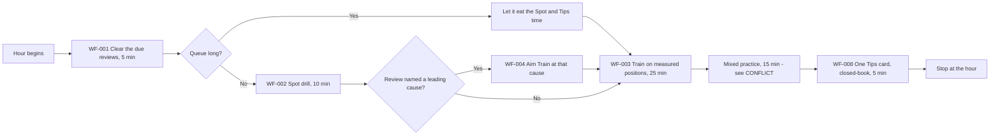
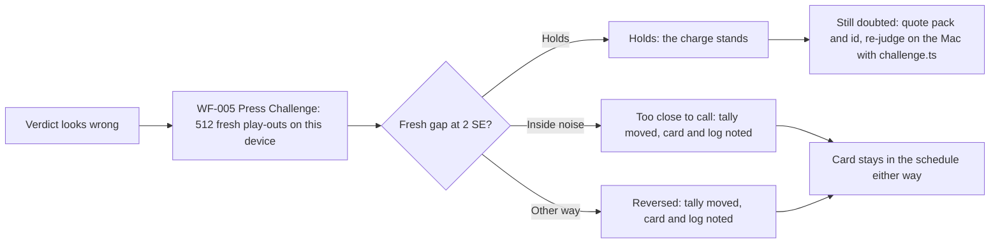
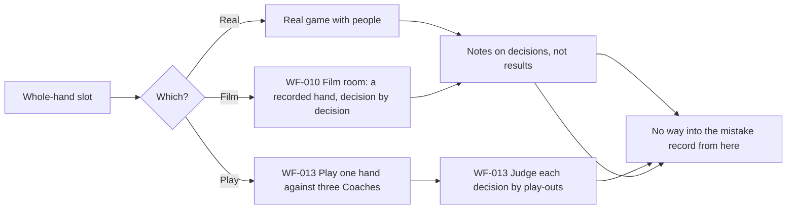
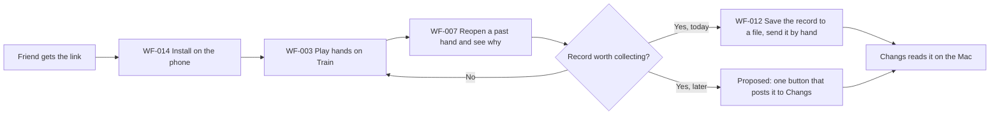

# USER JOURNEYS

## Purpose of this file

This file describes the important end-to-end experiences users go through.

## It answers

*What does each user need to accomplish, from their starting situation to their intended outcome?*

## What belongs here

Journeys that span the whole experience. A journey may cross several workflows, features, screens,
people, external systems, decisions, hand-offs and waiting periods. Give each a stable identifier
(`UJ-001`, `UJ-002`) and never renumber. Write from the user's perspective, with technical detail
only where it materially affects their experience.

## What does not belong here

The detailed steps of a workflow go in `WORKFLOWS.md` and are referenced here by ID. Capabilities
go in `FEATURES.md`. Rules go in `SPEC.md`. Unknown stages go in `OPEN-ITEMS.md`. Do not invent
stages to make a journey look complete.

## Journey vs workflow

A journey is broader. It normally contains several workflows and shows how they connect, where the
experience breaks between them, and what the user is trying to achieve overall. It does not repeat
their steps.

## What journeys are for

Use them to work out which workflows matter, which capabilities are necessary, what should be
prototyped, where hand-offs break, and whether the complete user outcome is actually supported.

## Check the set is complete

Walk the project's own operating model and confirm each step has a journey. Follow the things that
leave the system and come back, because the stages outside the system are usually where the
experience breaks. For this project the operating model is the practice hour and the seven stages in
`Framework - Mahjong.md`, plus the loop in `../CLAUDE.md`: learn a pattern, spot it, retrieve it,
work it out, decide, play for real, review, sort the mistake by cause, meet it again after a gap.

## When to update

When a journey is added or materially changes; when a hand-off, stage or outcome changes; when
prototype or user testing shows the real experience differs from what is recorded.

## Relationship to other files

`USERS.md` supplies the primary user. Journeys reference `WORKFLOWS.md` and `FEATURES.md` by ID.
They inform what `SPEC.md` must cover and what `PROTOTYPE.md` should test.

---

## Journey diagrams

A journey may carry a Mermaid diagram giving a visual of the same journey described in prose. The
written journey is canonical and the diagram is a derived aid; if they disagree, the prose is right
and the diagram is wrong. A diagram is included only where stages, branches or hand-offs make it
worth having; a linear journey is left in prose. Diagrams reference workflows at the stage where
they occur and do not reproduce their steps, and they must not introduce stages or branches that
appear nowhere else in the project knowledge. Prototype routes do not belong in a diagram; they
belong on the cards in `FEATURES.md` and `WORKFLOWS.md`.

---

## Journey Index

| ID | Journey | Primary User | Status |
|---|---|---|---|
| UJ-001 | Get the app onto a phone and keep the record safe | U-001, U-002 | Supported (OBSERVED); first-question time on 4G UNRESOLVED |
| UJ-002 | The practice hour | U-001 | Supported, with one CONFLICT between the framework and the app |
| UJ-003 | Working through the seven stages | U-001 | Stages 1 to 6 supported; stage 7 has no screen (UNRESOLVED) |
| UJ-004 | Dispute a verdict | U-001 | Supported (OBSERVED, measured) |
| UJ-005 | The weekly whole-hand session | U-001 | Partly supported; Play is a prototype and a real game has no way in |
| UJ-006 | A friend tests, and what they found reaches Changs | U-002 | Partly supported; the hand-off to Changs is by hand (PROPOSED button) |

---

## UJ-001 — Get the app onto a phone and keep the record safe

**Primary User:** U-001 Changs, and U-002 friends in the same way.

**Goal:** To have the trainer on the phone, working offline, with the table set to the one he
plays, and with the record backed up before it is worth losing.

**Starting Situation:** A phone with a browser and the address
`https://szethochangs.github.io/Mahjong/`, with the `/Mahjong/` on the end; the bare account
address is a 404 (CONFIRMED, `NEXT.md`).

**Trigger:** Changs starts training, or sends the link to a friend.

**Desired Outcome:** The app opens from the home screen, works with no signal after the first visit,
picks up new versions with a Reload bar, and the record has been saved to a file at least once.

### Journey Stages

#### 1. Open the site and install it

**What the user is trying to do:** Get an icon on the home screen.

**What happens:** The manifest declares a standalone app with a relative `start_url` and `scope`,
so an installed copy opens the site rather than the host's root; the green dragon on maroon is the
icon (OBSERVED, `web/public/manifest.webmanifest`; CONFIRMED as decided, `NEXT.md`). The service
worker registers on a built app and precaches every on-demand chunk from a list the build writes, so
every tab works offline after one visit (OBSERVED, `web/src/lib/update.ts`; CONFIRMED, `MOBILE.md`,
item 3). How long the first question takes on a real phone on 4G has not been measured
(UNRESOLVED, `NEXT.md`, "The one number still owed").

**Related Workflows:** WF-014.

**Related Features:** F-015.

**Pain Points / Risks:** iOS ignores the manifest in favour of the apple-touch-icon and zooms the
page if an input's font drops below 16px (CONFIRMED, `MOBILE.md`, item 5). The installed-app 404
was found by Changs on his phone on 2026-09-10 and fixed (CONFIRMED, `NEXT.md`).

#### 2. Set the table

**What the user is trying to do:** Tell the app which money and rules he plays.

**What happens:** The Table setup tab, behind More on a phone, carries five presets, three pay
modes, the ladder, the Zi Mo bonus, the minimum and maximum Tai, kong and bite amounts, and a
Jokers checkbox (OBSERVED, `web/src/components/TableSetup.tsx`). The first preset is labelled "your
table" and is the default (OBSERVED, `web/src/lib/money.ts`). The Play tab and the Challenge
button's pricing read these settings; the Train tab's "your table" banner reads the static
`data/table.config.json` instead (OBSERVED; see the note under F-012).

**Related Workflows:** WF-011.

**Related Features:** F-012.

**Pain Points / Risks:** Minimum Tai and Jokers on this tab change how hands play out, and the
screen says the pricing table below still reflects the recorded rules until the dataset is
regenerated (OBSERVED, on-screen text).

#### 3. Train for a week, then save the record

**What the user is trying to do:** Not lose a month of mistakes.

**What happens:** Everything the app remembers is in the browser's storage. The framework says to
save it at the end of the first week and then whenever he remembers, because the record is worth
most in its third and fourth week (CONFIRMED, `Framework - Mahjong.md`, "Running the app"). The
export writes the mistake record, the Spot scores and causes, the practise filter and the hand log to
one JSON file named by the day; restore replaces rather than merges (OBSERVED, `web/src/lib/backup.ts`).
The Play tab's hands, the table money settings and the Your hand tab's remembered seat are not in
the file (OBSERVED, `KEYS` in `backup.ts` against `mj.play.v1`, `mahjong.money.config` and
`mahjong.ask.table`).

**Related Workflows:** WF-012.

**Related Features:** F-013.

**Pain Points / Risks:** The Save button hands the browser a download, which on a phone lands
wherever that browser puts downloads; nothing in the project records where that is or whether
friends have managed it (UNRESOLVED).

#### 4. Take an update

**What the user is trying to do:** Get the latest version without reinstalling.

**What happens:** After each deploy a "new version is ready" bar appears with a Reload button; the
app checks for an update when it comes back to the foreground, at most hourly (OBSERVED,
`web/src/App.tsx`, `web/src/lib/update.ts`; CONFIRMED as decided, `MOBILE.md`, item 4).

**Related Workflows:** WF-014.

**Related Features:** F-015.

### Decisions / Hand-offs

- One device or two. Everything the app remembers lives in one browser, and two devices mean two
  records. The options are one device with the other read-only, the export as a manual bridge, or a
  real sync that would need a server (CONFIRMED as the options, `PLAN.md`; the choice for Changs's
  own devices is UNRESOLVED).

### Risks / Failure Points

- A cleared cache takes the record with it (CONFIRMED, `web/src/lib/backup.ts` header and Table
  setup text).
- A restore that overwrites a newer record with an older file; the app says what it is about to
  replace but does not merge (OBSERVED).

### Related Workflows

WF-011, WF-012, WF-014.

### Related Features

F-012, F-013, F-015.

### Related User Stories

US-012, US-013, US-014.

### Open Items

The first-question time on 4G. The one-device-or-two decision for Changs's own use. Whether the
Play tab's hands should be in the backup.

---

## UJ-002 — The practice hour

**Primary User:** U-001 Changs.

**Goal:** To spend one hour, three days a week, on the five components of the training system in
the order and proportions the framework sets, so that the record fills, the leading cause changes
over time, and the Train score rises.

**Starting Situation:** A Tuesday, Thursday or Saturday; the app installed; a record that may or
may not have anything due.

**Trigger:** The day comes round (CONFIRMED, `Framework - Mahjong.md`, "The practice hour").

**Desired Outcome:** The due reviews are cleared first, every mistake made is recorded and sorted by
cause, and the hour stops at the hour.

### Journey Diagram

### Journey Stages

#### 1. Clear what is due

**What the user is trying to do:** Meet the mistakes that have come round, first and while fresh.

**What happens:** The Review tab lists what is due, oldest first. Each card comes back as the bare
position with nothing attached, he works it out again, then sorts or confirms the cause. Right moves
the card to the next interval; wrong sends it back to the start (OBSERVED,
`web/src/components/Review.tsx`, `web/src/lib/mistakes.ts`; CONFIRMED as the method,
`../CLAUDE.md` and `Framework - Mahjong.md`). If the queue is long it is allowed to eat the Spot and
Tips time, never the Train time (CONFIRMED, framework).

**Related Workflows:** WF-001.

**Related Features:** F-006, F-007.

**Pain Points / Risks:** Most days nothing is due, and the diagnosis is shown anyway because that is
when it is worth reading (OBSERVED, `Review.tsx` comment).

#### 2. Spot

**What the user is trying to do:** Train seeing as a skill separate from solving.

**What happens:** A position shows for 3, 5 or 8 seconds, goes face down, and one of four questions
is asked. Scores are kept per question. A miss is sorted into one of four seeing causes, and once
six or more misses are sorted the drill offers to lengthen or shorten the look (OBSERVED,
`web/src/components/Spot.tsx`, `web/src/lib/spotstats.ts`; CONFIRMED as intent, framework, "The
stages", third stage).

**Related Workflows:** WF-002.

**Related Features:** F-005.

**Pain Points / Risks:** The framework starts the drill at eight seconds; the tab opens at five
(CONFLICT, recorded under WF-002).

#### 3. Train, aimed if there is a leading cause

**What the user is trying to do:** Work positions out with no help, and where the record has named a
cause, work the positions where that cause bites.

**What happens:** The Train tab serves real recorded positions graded by play-outs, on the table
chosen by pack. The verdict, the bars, the Coach's reasoning and any shape card the position is
about appear after the answer. Mistakes and blunders on discards go into the record; every discard
goes into the hand log (OBSERVED, `web/src/components/Train.tsx`). The Review tab's "Practise" button
lands here with the leading cause already set as the filter (OBSERVED). When the filters leave the
pack nothing, a made-up hand is dealt instead, under a banner saying it is made up and that the
Coach marks it (OBSERVED, `Train.tsx`, `GeneratedHand.tsx`).

**Related Workflows:** WF-003, WF-004, WF-006.

**Related Features:** F-001, F-002, F-003.

**Pain Points / Risks:** Claims are graded but never recorded, because the review screen can only
ask "which tile" (OBSERVED, `Train.tsx` comments). On a pack question the app does not suggest a
cause for the mistake at the moment it is made; the cause is first asked when the card comes back a
day later (OBSERVED; CONFLICT with the framework's "The app suggests one from the position and you
confirm or correct it", recorded under WF-003).

#### 4. Mixed practice

**What the user is trying to do:** Meet positions with no label and no promise anything special is
happening, which is the component that carries into real play.

**What happens:** This is where the framework and the app disagree. The framework's hour gives
twenty-five minutes to a Train tab graded by the Coach and fifteen to a "Real quiz" graded by
play-outs, and calls the gap between the two the honest measure of transfer (CONFIRMED,
`Framework - Mahjong.md`, "The practice hour" and "How honest the feedback is"). Since 2026-09-10 the
app has one practice tab, Train, which is the old Real quiz with the Coach as a labelled fallback
(CONFIRMED, `NEXT.md`, "The merge"; OBSERVED, `Train.tsx`). `NEXT.md` notes the framework still says
"Real quiz" and takes the view that it is a record of what was measured and should keep the name.

**Related Workflows:** WF-003.

**Related Features:** F-001.

**Pain Points / Risks:** CONFLICT. The framework describes an hour with two practice tabs and a
Coach-graded Train tab; the app has one tab graded by play-outs. Either the framework's hour is
rewritten as forty minutes on one tab, or the two are kept apart by some other means. This is not
resolved in any file and is a question for Changs.

#### 5. One card, book closed

**What the user is trying to do:** Explain a tip out loud in plain words and find the sentence that
falls apart.

**What happens:** The Tips page holds 103 cards, each with a badge saying what backs it: 59
measured, 4 confirmed by counting, 6 rules of the table, 16 advice, 18 contradicted (OBSERVED, the
verdict counts in `solver/src`; CONFIRMED, framework, "The patterns"). Reading is on the screen; the
explaining is not, and nothing in the app records that it happened.

**Related Workflows:** WF-008.

**Related Features:** F-009.

**Pain Points / Risks:** The eighteen contradicted cards must be read but not learnt (CONFIRMED,
framework). Nothing in the app tracks which cards have been done.

### Decisions / Hand-offs

- Whether the queue is long enough to eat the Spot and Tips time. The framework gives the rule; the
  app does not enforce it (CONFIRMED rule, OBSERVED absence).
- Whether a leading cause has been at the top long enough to aim the Train tab at it, and when to go
  back to the unfiltered deck (CONFIRMED, framework, fifth stage).

### Risks / Failure Points

- The hour running past the hour, which the framework says turns into entertainment that feels like
  work (CONFIRMED). Nothing in the app measures time.
- The CONFLICT in stage 4.

### Related Workflows

WF-001, WF-002, WF-003, WF-004, WF-008.

### Related Features

F-001, F-002, F-003, F-005, F-006, F-007, F-009.

### Related User Stories

US-001, US-002, US-003, US-005, US-006, US-007.

### Open Items

The CONFLICT over the shape of the hour. The CONFLICT over the Spot starting look. The CONFLICT over
cause suggestion on pack questions. Whether the app should count the hour's minutes at all
(PROPOSED by nobody; noted so that it is not built unasked).

---

## UJ-003 — Working through the seven stages

**Primary User:** U-001 Changs.

**Goal:** To move from knowing what a hand is worth to pushing and folding, each stage assuming the
last, with the mistake record running throughout.

**Starting Situation:** The framework written and not yet trained (CONFIRMED, `NEXT.md`, "What needs
Changs", item 1 asks him to use the practice hour for a week).

**Trigger:** Deciding to start.

**Desired Outcome:** Each stage's exit condition met before the next begins.

This journey is linear and is described in prose; a diagram would only restate the list.

### Journey Stages

#### 1. The table

**What the user is trying to do:** Learn the Tai table, what the 2 Tai minimum does, and what the
shooter pays, until a hand can be priced without thinking.

**What happens:** A week of reading, not drilling (CONFIRMED, framework, first stage). The Table
setup tab's money ladder and "What this table rewards" are the only screens that bear on it
(OBSERVED). This stage is mostly outside the app.

**Related Workflows:** WF-011.

**Related Features:** F-012.

#### 2. The vocabulary

**What the user is trying to do:** Read the Tips page phase by phase so that shapes look familiar
later, without trying to memorise.

**What happens:** The page runs in the order a hand happens: what you are dealt, building, choosing
what to throw, claiming, reading, fighting or folding, how to play (OBSERVED, `Tips.tsx`). The
eighteen contradicted cards are read for why they fail (CONFIRMED, framework).

**Related Workflows:** WF-008.

**Related Features:** F-009.

#### 3. Spotting

**What the user is trying to do:** Get all four Spot questions above about sixty per cent at eight
seconds, then shorten to five, then three, taking the drill's own offer to move rather than guessing
(CONFIRMED, framework, third stage).

**What happens:** As in UJ-002 stage 2.

**Related Workflows:** WF-002.

**Related Features:** F-005.

#### 4. Working it out

**What the user is trying to do:** Say why before tapping, on the hand types just read about.

**What happens:** The Train tab. The framework's fourth stage names the Train tab as Coach-graded
and the fifth stage names the Real quiz; the app now has the one tab (the CONFLICT in UJ-002).

**Related Workflows:** WF-003.

**Related Features:** F-001.

#### 5. Mixed practice, aimed when a cause leads

**What the user is trying to do:** Meet unlabelled real positions, and when a cause has been at the
top for a while, meet only positions where that cause bit.

**What happens:** The cause filter on Train and the "Practise" button on Review (OBSERVED). The
framework says to expect to be worse here than on the Train tab; with one tab that comparison no
longer exists (part of the same CONFLICT).

**Related Workflows:** WF-003, WF-004.

**Related Features:** F-001, F-002.

#### 6. Reading

**What the user is trying to do:** Watch what a seat's discards said about it before the hand ended.

**What happens:** The read cards on Tips, the "Reading the other seats" card on Table setup, and the
Film room, which replays 180 recorded hands from each of two runs decision by decision with what
every legal move was worth (OBSERVED, `Replay.tsx`, `web/public/replays/index.json`).

**Related Workflows:** WF-010.

**Related Features:** F-011, F-012.

#### 7. Pushing and folding

**What the user is trying to do:** Decide whether a hand is worth playing at all.

**What happens:** Nothing in the app poses this as a question. `PLAN.md` lists "push-or-fold with
opponents' discards shown" under "Later" and it is not built (CONFIRMED as intended someday,
`PLAN.md`; UNRESOLVED when). The Play tab is the only place a fold can be made in context, and its
judge is not yet trusted on claims (OBSERVED, `Play.tsx` on-screen text).

**Related Workflows:** WF-013.

**Related Features:** F-014; F-019 proposed.

### Decisions / Hand-offs

- When a stage is done. The framework gives a threshold only for Spot (about sixty per cent on all
  four questions); the other stages have none (CONFIRMED absence).

### Risks / Failure Points

- Stage 7 has no drill, so the top rung is reached with only the Play prototype to stand on.
- The stage order is the project's own best guess and nothing tested it (CONFIRMED, framework, "How
  much of this we believe").

### Related Workflows

WF-002, WF-003, WF-004, WF-008, WF-010, WF-011, WF-013.

### Related Features

F-001, F-002, F-005, F-009, F-011, F-012, F-014.

### Related User Stories

US-001 to US-011, US-015.

### Open Items

Whether a push-or-fold drill is wanted before the rest of the game (UNRESOLVED; `NEXT.md` puts the
claim judge first and the game second, and does not mention push-or-fold).

---

## UJ-004 — Dispute a verdict

**Primary User:** U-001 Changs.

**Goal:** To find out whether a "big mistake" badge is right, on the device, without taking the
verdict on trust.

**Starting Situation:** A verdict on the Train tab that he thinks is wrong. This has happened: on
`coach · 6310:4:31` he threw 1筒 and was charged $4.03; re-judged at 2,048 fresh play-outs the three
top tiles were within 28 cents and the pack was wrong (CONFIRMED, `FINDINGS.md`, "The packs
overstate their certainty").

**Trigger:** Doubt.

**Desired Outcome:** A second opinion on fresh dice, and the record and log corrected if the charge
does not hold.

### Journey Diagram

### Journey Stages

#### 1. Challenge on the device

**What the user is trying to do:** Re-judge without a server.

**What happens:** The button plays out the pick, the pack's best, and the runner-up if it is a third
tile, at 512 fresh play-outs each in a Web Worker, and reports holds, too close to call, or reversed
at the same two-standard-error bar the pack admits on (OBSERVED, `web/src/lib/rejudge.ts`,
`Train.tsx`). On the Mac that is about a second; a phone is three to five times slower behind a
progress bar (CONFIRMED, `FINDINGS.md`, "The Challenge button runs on the phone"). The rebuild of
the position from the question alone was checked on 100 of 100 questions with identical play-outs
(CONFIRMED, same section).

**Related Workflows:** WF-005.

**Related Features:** F-004.

**Pain Points / Risks:** A pack built before 2026-09-06 cannot be rebuilt and the button says so
(OBSERVED). The button disappears once it has answered, so a second opinion needs the next stage.

#### 2. The record is told

**What the user is trying to do:** Not carry a wrong charge into the schedule.

**What happens:** When the original verdict charged a mistake and the fresh dice do not uphold it,
the hand log entry and the mistake card get a `challenged` note with the fresh gap and its error, and
the session tally moves the answer to "too close to call". The card stays in the schedule, because a
coin flip is not proof the throw was right (OBSERVED, `Train.tsx`, `mistakes.ts`, `history.ts`;
CONFIRMED as intent, `FINDINGS.md`).

**Related Workflows:** WF-005, WF-001.

**Related Features:** F-004, F-006, F-008.

#### 3. Outside the app: the Mac

**What the user is trying to do:** Settle it properly.

**What happens:** The position id is shown on the verdict screen so it can be quoted, and
`challenge.ts` on the Mac re-judges it at 2,048 play-outs in seconds (CONFIRMED, `FINDINGS.md`). This
stage is outside the app and needs the repository.

**Related Workflows:** None in the app.

**Related Features:** None; the machinery is in `solver/` and `datagen/`.

### Decisions / Hand-offs

- Whether a "too close to call" is worth the Mac. Nothing decides this but Changs.

### Risks / Failure Points

- About one verdict in ten was a close call wearing a decisive badge before the verify pass; every
  question now on the site has cleared 2 SE twice on independent play-outs, so the badges are as
  certain as they claim (CONFIRMED, `FINDINGS.md`). The challenge remains the way to check one.

### Related Workflows

WF-005.

### Related Features

F-004, F-016.

### Related User Stories

US-004.

### Open Items

None recorded.

---

## UJ-005 — The weekly whole-hand session

**Primary User:** U-001 Changs.

**Goal:** Once a week, ideally Saturday, to play or watch a whole hand and take notes on decisions he
cannot justify rather than on hands he lost (CONFIRMED, framework, "The practice hour").

**Starting Situation:** The Saturday hour done, or a real game arranged.

**Trigger:** The week's whole-hand slot.

**Desired Outcome:** Decisions from a whole hand judged against the Measured Best, and any mistake
carried into the record.

### Journey Diagram

### Journey Stages

#### 1. Choose the session

**What the user is trying to do:** Pick between a real game, the Play tab and the Film room.

**What happens:** The framework names the real game and the Film room (CONFIRMED). The Play tab
arrived on 2026-09-11 as a prototype: one hand against three Coaches at the table set up in Table
setup, behind More on a phone because it is not the training tool (OBSERVED, `App.tsx`, `Play.tsx`;
CONFIRMED as the reasoning, `PLAN.md`, "Where this is going: a game").

**Related Workflows:** WF-010, WF-013.

**Related Features:** F-011, F-014.

#### 2. Play or watch the hand

**What the user is trying to do:** Sequence a hand, fold in the middle of one, make calls in
context, watch the wall run out; the things no drill gives (CONFIRMED, `PLAN.md`).

**What happens:** On Play, the bots move one decision every 350 ms, "Skip to my turn" runs them to
the next human decision, every legal action is a button and nothing else is, and the position before
each human decision is kept as an engine snapshot (OBSERVED, `Play.tsx`). In the Film room, a
recorded hand is scrubbed decision by decision with EV bars and the Coach's words (OBSERVED,
`Replay.tsx`). At a real game the Your hand tab can answer a discard or claim question from the
tiles he is holding; the code says that is the one place the question actually comes up, and
whether he uses it there is not recorded (OBSERVED, `AskHand.tsx` header; UNRESOLVED use).

**Related Workflows:** WF-009, WF-010, WF-013.

**Related Features:** F-011, F-014.

**Pain Points / Risks:** The human always sits at seat 0 and the prevailing wind is always East;
sessions, rotation and a running score are not built (OBSERVED, `deal()` in `Play.tsx`; CONFIRMED as
next after the loop is trusted, `NEXT.md`, item 2).

#### 3. Judge the decisions

**What the user is trying to do:** Learn which of the twenty or so decisions were wrong, against the
measured best rather than against the result.

**What happens:** Each decision can be judged on demand at 256 play-outs per action, comparing at
most six actions (the one taken plus the five the Coach likes best), with "Judge all" for the whole
hand. Verdicts are best, too close to call, or mistake at 2 SE, and are written back so a reopened
hand does not spend the play-outs twice (OBSERVED, `Play.tsx`, `web/src/lib/play.ts`,
`rejudge.ts`). The screen says to trust it on throws and not yet on Pong, Chow or taking a win,
because the play-out bots never fold and rarely win first (CONFIRMED, `FINDINGS.md`, "The whole-hand
judge is honest on throws and not yet on claims").

**Related Workflows:** WF-013.

**Related Features:** F-014; F-017 proposed.

#### 4. Carry a mistake into the record

**What the user is trying to do:** Meet the whole-hand mistake again after a gap, like any other.

**What happens:** Nothing. A Play tab mistake is stored with the hand in `mj.play.v1`, up to twenty
hands, and never enters the mistake record or the hand log; a real-game note has no place in the app
at all (OBSERVED absence, `play.ts` against `mistakes.ts`). The framework's instruction to take
notes on a real game has no screen behind it (CONFIRMED instruction, OBSERVED absence).

**Related Workflows:** None.

**Related Features:** None; a gap.

### Decisions / Hand-offs

- Whether the Play loop feels like mahjong and whether the review is worth reading, which `NEXT.md`
  says decides what gets built next (CONFIRMED, "What needs Changs", item 1; UNRESOLVED answer).

### Risks / Failure Points

- Play quietly taking the drills' hour; `PLAN.md` says this plainly and the tab is placed behind More
  for that reason (CONFIRMED).
- The claim judge's bias, until a stronger rollout policy for claims is built and measured against
  the known claim results (CONFIRMED as the fix, `NEXT.md` item 1; PROPOSED as F-017).

### Related Workflows

WF-010, WF-013.

### Related Features

F-011, F-014.

### Related User Stories

US-010, US-015.

### Open Items

Whether Play mistakes should enter the mistake record. Whether a real-game note needs a place.
Whether the human should rotate seats and winds. All UNRESOLVED; none asked for yet.

---

## UJ-006 — A friend tests, and what they found reaches Changs

**Primary User:** U-002 a friend.

**Goal:** To try the trainer on their own phone and, if their record turns out to be worth having,
get it to Changs.

**Starting Situation:** A link from Changs.

**Trigger:** Curiosity, or Changs asking.

**Desired Outcome:** A working install, some hands played, a past hand reopenable with its
reasoning, and a record that can reach Changs.

### Journey Diagram

### Journey Stages

#### 1. Install and start

**What the user is trying to do:** Get going without an account.

**What happens:** As UJ-001 stage 1. No login by decision (CONFIRMED, `MOBILE.md`; `NEXT.md`,
"Decided").

**Related Workflows:** WF-014.

**Related Features:** F-015.

#### 2. Train

**What the user is trying to do:** Answer positions and understand the answers.

**What happens:** As UJ-002 stage 3. Their record fills on their phone alone.

**Related Workflows:** WF-003.

**Related Features:** F-001.

#### 3. Look back at a hand

**What the user is trying to do:** See a hand they played and why the answer was what it was.

**What happens:** "Hands you have played" on the Review tab keeps the last 200 answered discards,
newest first, and opens one with the answer and the reasoning shown. Built for friends (CONFIRMED,
`NEXT.md`; OBSERVED, `Review.tsx`, `history.ts`).

**Related Workflows:** WF-007.

**Related Features:** F-008.

#### 4. Get the record to Changs

**What the user is trying to do:** Hand over what they did.

**What happens:** Today, the export on Table setup and then whatever channel they and Changs use;
the app does no sending. The intended button that posts the same JSON is described and not built
(CONFIRMED as intent, `MOBILE.md`; PROPOSED, F-018). Whether the records are worth collecting is to
be decided "after a fortnight" (CONFIRMED wording, UNRESOLVED decision).

**Related Workflows:** WF-012.

**Related Features:** F-013; F-018 proposed.

**Pain Points / Risks:** The Table setup tab is behind More and its first card is the backup, but
nothing tells a friend it exists (OBSERVED layout, UNRESOLVED whether that matters).

### Decisions / Hand-offs

- The hand-off from the friend's phone to Changs is entirely outside the app.

### Risks / Failure Points

- What friends have actually reported is not written anywhere in the project (UNRESOLVED), so the
  test may already have produced evidence that is only in conversation.

### Related Workflows

WF-003, WF-007, WF-012, WF-014.

### Related Features

F-001, F-008, F-013, F-015; F-018 proposed.

### Related User Stories

US-008, US-013, US-014, US-018.

### Open Items

Who the friends are, what they found, and whether a send button is wanted.
